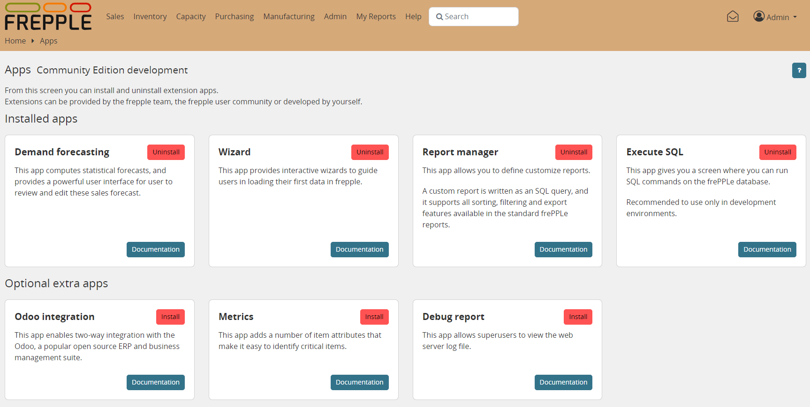

==============
Extension apps
==============

FrePPLe has a modular architecture. There are a number of core modules,
and also a number of optional apps that provide new functionality.

Extensions can be installed and uninstalled interactively by users in the
`apps screen </user-interface/getting-around/apps.html>`_. Superuser privileges
are required. Installed apps are always active across all scenarios.

Extensions can be provided by the frepple team,
`the frepple user community <https://github.com/frePPLe/frepple/discussions/>`_
or `developed by yourself <../developer-guide/creating-an-extension-app.html>`_.

.. toctree::
   :maxdepth: 2

   executesql
   forecast
   mlforecast
   metrics
   odoo
   reportmanager
   wizard
   debugreport
   erpconnection

