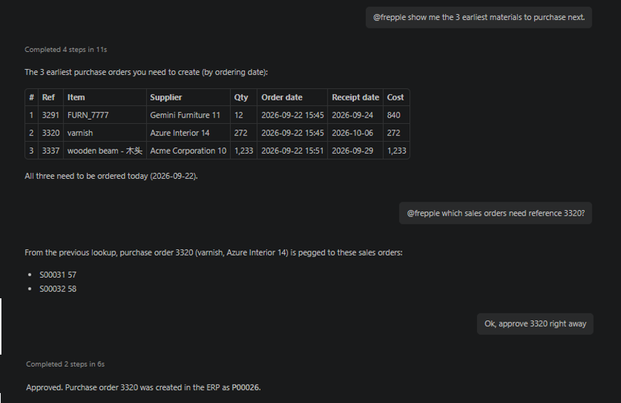

=============
AI MCP server
=============

  .. Important::

     This app is only available in the Enterprise and Cloud Editions.

Overview
========

This app allows Frepple to communicate with AI agents through the
`MCP standard <https://modelcontextprotocol.io>`_.
Chat with your AI agent (like Claude, Gemini, ChatGPT...) to query and update the plan.

Technical setup
===============

The app is registered as a standard Frepple application and can be enabled or disabled
from the Admin/Apps menu.

The MCP server currently includes the following functions:

- ``searchDocumentation``: searches the Frepple documentation with a keyword.
- ``getPurchaseOrders``: retrieves a list of purchase orders filtered by the specified criteria the user requested.
- ``getDistributionOrders``: retrieves a list of distribution orders filtered by the specified criteria the user requested.
- ``getManufacturingOrders``: retrieves a list of manufacturing orders filtered by the specified criteria the user requested.
- ``getWorkOrders``: retrieves a list of work orders filtered by the specified criteria the user requested.
- ``getSalesOrders``: retrieves a list of sales orders filtered by the specified criteria the user requested.
- ``getDeliveryPlan``: retrieves the delivery plan for the specified sales orders.
- ``ApproveOrder``: approves the specified order (either a manufacturing order, a work order, a purchase order, or a distribution order).

The above list will be extended as new functions are added to the MCP server.

Using the app
=============

1. Ensure the app is enabled in Admin/Apps menu.
2. | Connect your AI agent to the server endpoint.

   | It is important to use a different endpoint for each scenario.
   | ``https://your-frepple-instance/mcp`` for the default scenario.
   | ``https://your-frepple-instance/scenario1/mcp`` for the scenario1.
   | ``https://your-frepple-instance/scenario2/mcp`` for the scenario2.
   | ...

3. Authenticate the client using an API key (using the menu Admin/My API Keys). The AI agent will connect to the MCP server (and access the Frepple data)
   as the user owning this key.

4. Chat with your AI agent.
   Some typical questions and actions include:

   - What are the purchase orders I should expedite?
   - What are the manufacturing orders I should process today?
   - Retrieve all manufacturing and purchase orders pegged to a specific sales order.
   - Export to the ERP all purchase orders of sales order SO001.
   - Approve the manufacturing orders proposed in the next 3 days
   - List the proposed purchase orders due this week.
   - Show me the open manufacturing orders for item A.
   - Find the delivery plan for sales order SO001.
   - Search the documentation for forecast editor usage.

Permissions and security
=========================

The MCP server respects the permissions of your user. The AI agent operates with the same privileges
as the user would have within the regular user interface.

Configure your AI agent with a user account that has the appropriate permission set
for the operational tasks you want it to perform. Using a superuser account may not be the
best idea...
