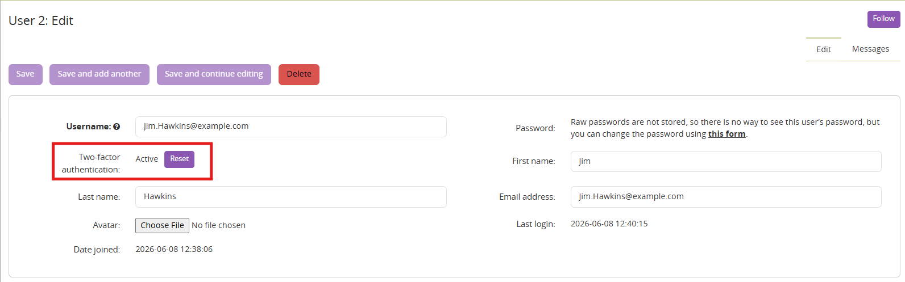

======================================
One-time password (OTP) authentication
======================================

  .. Important::

     This app is only available in the Enterprise and Cloud Editions.

This app adds mandatory two-factor authentication (2FA) using time-based
one-time passwords (TOTP) to all user accounts. When enabled, every user
must complete a second verification step during login using an authenticator
app such as Google Authenticator or Microsoft Authenticator.

How it works
------------

When the OTP Authentication app is installed, two-factor
authentication becomes mandatory for all users:

- **First login (enrollment):** Users who have not yet set up 2FA are
  presented with an enrollment dialog after entering their credentials.
  They must scan a QR code with their authenticator app and enter the
  generated 6-digit code to confirm the setup.

- **Subsequent logins:** Users who have already enrolled are prompted to
  enter their 6-digit authentication code after providing their username
  and password.

- **External authentication:** Users authenticating via an external
  identity provider (login with Google, login with Microsoft...) bypass the TOTP requirement,
  as the SSO provider is trusted to handle its own multi-factor authentication.

- **API access:** Basic authentication is blocked when this app is enabled.
  Use JWT webtokens or API keys instead.

Resetting a user's 2FA
-----------------------

If a user loses access to their authenticator app, an administrator can
reset their 2FA enrollment by resetting the 2FA secret key in the user form.

This will require the user to go through the enrollment process again on their next login.
