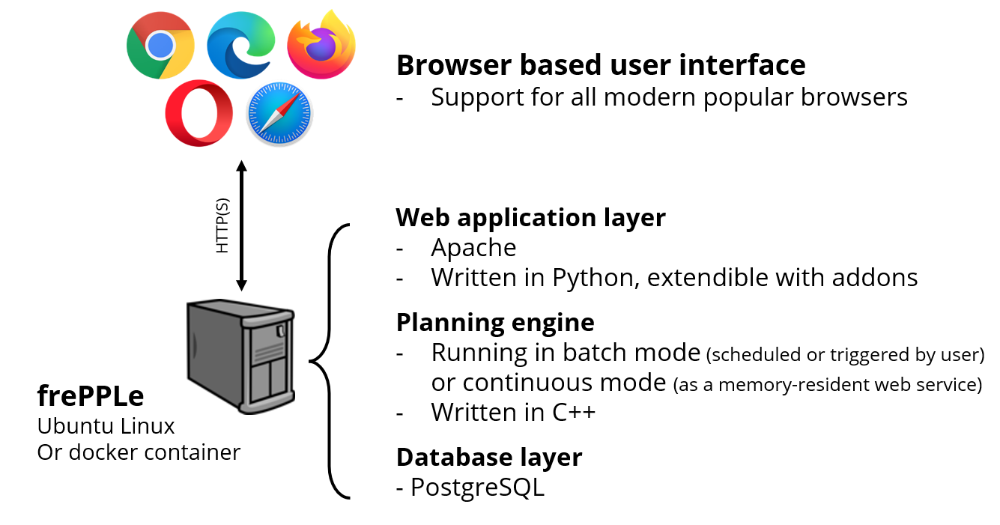

============
Architecture
============

FrePPLe has a 3-tier architecture, typical for most web applications.

* | **Browser based front-end**:
  | The user interface is completely web browser based, using state of the
    art web techniologies such as HTML5 and ajax.
  | FrePPLe supports most modern browsers: Google Chrome, Firefox, Safari,
    Internet Explorer(>=10) and Opera.

* | **Web server**:
  | The web server retrieves data from the database and serves the content
    as HTML pages to the user.
  | FrePPLe supports the Apache web server, and also has a built-in
    Python-based web server.
  | Long running tasks (such as the planning algorithm, database backup,
    scenario copying, ...) don’t run in the web server process. Instead,
    the web server will spawn a separate worker process to execute these.

* | **Database backend**:
  | The planning data are stored in a PostgreSQL relational database.
  | The database schema is simple and stable, which makes is possible to
    integrate with external applications directly at the database level.

A special use case is to use frePPle as a **backend planning engine without user interface**.
In this case the planning engine can be embedded in another system. Users
use the other system as the front-end, and frePPLe's algorithms are used in
the back-end to generate the plans.
