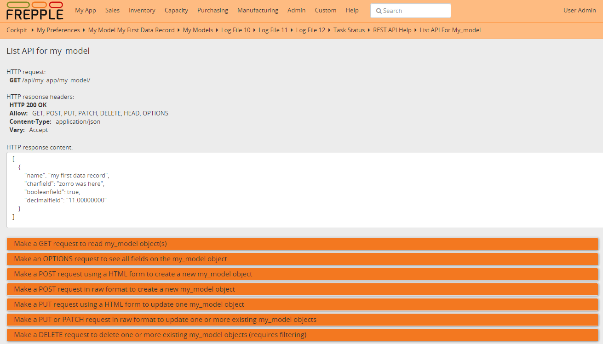
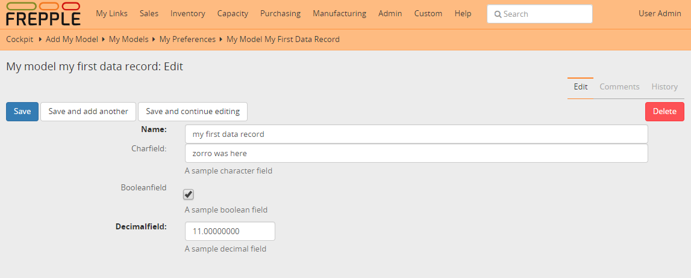
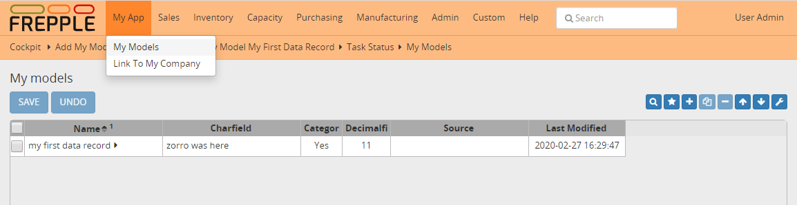
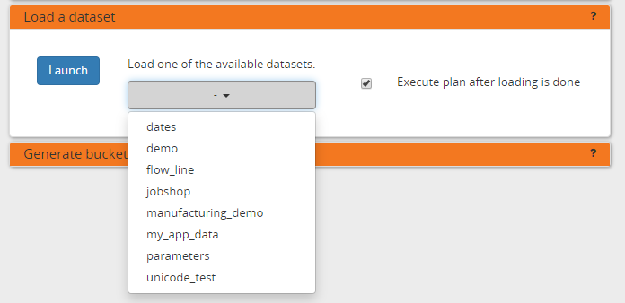
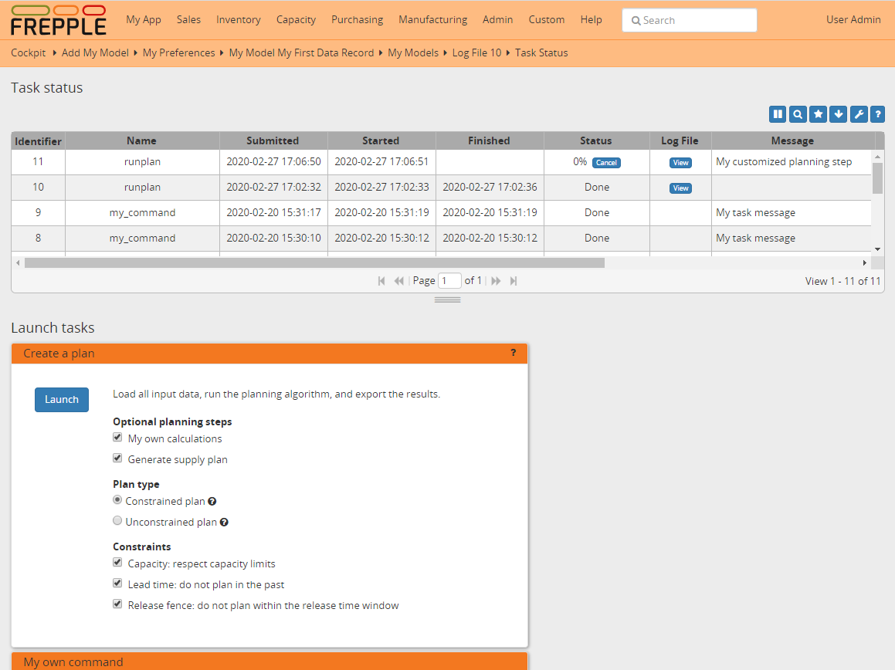
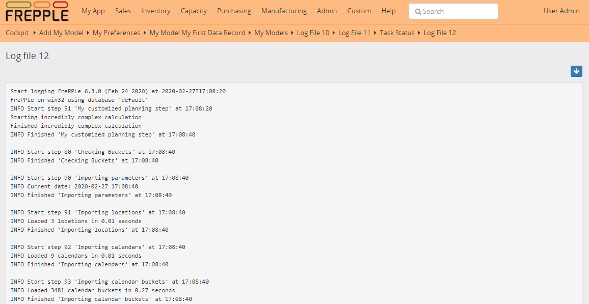
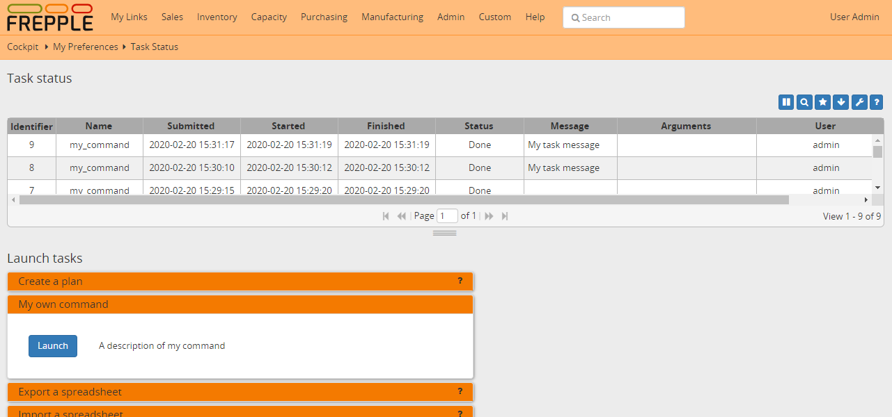

=========================
Creating an extension app
=========================

This page outlines the steps involved in creating a custom app.
It walks you through the technical step and explores the capabilities
custom apps provide to tailor frePPLe to your business needs.

* :ref:`app_prerequisites`
* :ref:`app_folder`
* :ref:`app_registration`
* :ref:`app_dockerstart`
* :ref:`app_attributes`
* :ref:`app_models`
* :ref:`app_migrations`
* :ref:`app_rest_api`
* :ref:`app_edit_form`
* :ref:`app_views`
* :ref:`app_urls`
* :ref:`app_menu`
* :ref:`app_fixtures`
* :ref:`app_plan_generation`
* :ref:`app_commands`
* :ref:`app_unit_tests`
* :ref:`app_more_info`

.. _app_prerequisites:

Prerequisites
-------------

You will need to be familiar with the
`Python programming language <http://python.org/>`_ to complete this tutorial.

Knowledge of HTML and SQL is also needed to fully understand how your
app works within the frePPLe framework.

In this tutorial we'll be using a `docker container <https://www.docker.com/>`_
to package and deploy your customized version of frePPLe. While there are other
methods to install and deploy, we highly recommend using a container: it's the
maintable, clean and modern way to manage your application.

.. _app_folder:

Download the tutorial app
-------------------------

An app is structured as a Python module that needs to follow a specific structure.
You can create a skeleton structure for your app by unzipping this file.
and place its contents under the freppledb folder.

:download:`Download zip-file with sample extension <my-app.zip>`

.. code-block:: none

   dockerfile
   my-app
      |- __init__.py
      |- models.py
      |- attributes.py
      |- migrations
      |   |- __init__.py
      |   |- 0001-initial.py
      |   |- 0002-attributes.py
      |- admin.py
      |- serializers.py
      |- views.py
      |- urls.py
      |- menu.py
      |- commands.py
      |- fixtures
      |   |- my_app_data.json
      |- tests.py
      |- management
          |- __init__.py
          |- commands
              |- __init__.py
              |- mycommand.py

.. _app_registration:

Register your app
-----------------

In the file **djangosettings.py** your new app needs to be added in the
section INSTALLED_APPS.

The ordering of the apps is important - apps higher in the list can
override functionality of apps lower in the list. Insert your app
at the location indicated in the file.

.. code-block:: Python

   INSTALLED_APPS = (
       "django.contrib.auth",
       "django.contrib.contenttypes",
       "django.contrib.messages",
       "django.contrib.staticfiles",
       "freppledb.boot",
       # Add any project specific apps here
       "myapp",  # <<<< HERE'S OUR APP
       # "freppledb.odoo",
       # "freppledb.erpconnection",
       "freppledb.input",
       "freppledb.output",
       "freppledb.metrics",
       "freppledb.execute",
       "freppledb.common",
       "django_filters",
       "rest_framework",
       "django.contrib.admin",
       # The next two apps allow users to run their own SQL statements on
       # the database, using the SQL_ROLE configured above.
       "freppledb.reportmanager",
       # "freppledb.executesql",
   )

.. _app_dockerstart:

Run your docker container
-------------------------

It's time to start your customized container a first time.

After every edit in the app you'll need to rebuild your custom
image and container. Don't worry, it lasts only a few seconds and
you don't loose the data from the database.

.. code-block:: Bash

   docker build my_frepple -t -my_frepple

   docker run \
     -e POSTGRES_HOST=host.docker.internal \
     -e POSTGRES_PORT=5432 \
     -e POSTGRES_USER=frepple \
     -e POSTGRES_PASSWORD=frepple \
     -e POSTGRES_DBNAME=freppledb \
     --restart always \
     --name my_frepple \
     --publish 9000:80 \
     --detach \
     my_frepple

If all went well you can access frepple with your browser now on
http://localhost:9000.

.. _app_attributes:

Extend existing models with new fields
--------------------------------------

The file **attributes.py** defines new fields that extend the standard
data model. For instance, pretty much every implementation has some
specific item characteristics which the planner would like to see.

.. code-block:: Python

   ...
   registerAttribute(
       "freppledb.input.models.Item",  # Class we are extending
       [
           (
               "attribute_1",  # Field name in the database
               _("first attribute"),  # Human readable label of the field
               "number",  # Type of the field.
               True,  # Is the field editable?
               True,  # Should the field be visible by default?
           )
       ],
   )
   ...

This file only declares the model structure. The actual database field will be
created in a following step.

.. _app_models:

Define the database models
--------------------------

The file **models.py** describes new database models. It defines the database tables,
their fields and indexes.

.. code-block:: Python

   class My_Model(AuditModel):
       # Database fields
       name = models.CharField(_("name"), max_length=300, primary_key=True)
       charfield = models.CharField(
           _("charfield"),
           max_length=300,
           null=True,
           blank=True,
           help_text=_("A sample character field"),
       )
       booleanfield = models.BooleanField(
           _("booleanfield"),
           blank=True,
           default=True,
           help_text=_("A sample boolean field"),
       )
       decimalfield = models.DecimalField(
           _("decimalfield"),
           max_digits=20,
           decimal_places=8,
           default="0.00",
           help_text=_("A sample decimal field"),
       )

       class Meta(AuditModel.Meta):
           db_table = "my_model"  # Name of the database table
           verbose_name = _("my model")  # A translatable name for the entity
           verbose_name_plural = _("my models")  # Plural name
           ordering = ["name"]

This file only declares the model structure. The actual table will be created in a
later step.

You can find all details on models and fields on https://docs.djangoproject.com/en/4.2/ref/models/fields/

.. _app_migrations:

Create tables and fields in the database
----------------------------------------

In the previous steps all models and attributes were defined. The database tables
are automatically created in the PostgreSQL database when you start the docker
container.

In exceptional situations you can run them manually with the following statement
on the command line:

.. code-block:: none

   frepplectl migrate

This command will incrementally bring the database schema up to date. The database
schema migration allows upgrading between different versions of frePPLe (or your ap)
without loss of data and without recreating the database from scratch.

Migration scripts are Python scripts, located in the **migrations** folder. The scripts
are generated mostly automatic with the command line below. More complex migrations will
need review and/or coding by developers.

.. code-block:: none

   # Generate a skeleton migration script - run by developers only
   frepplectl makemigrations my_app

.. code-block:: Python

   class Migration(AttributeMigration):

       # Module owning the extended model
       extends_app_label = "input"

       # Defines migrations that are prerequisites for this one
       dependencies = [("my_app", "0001_initial")]

       # Defines the migration operation to perform: such as CreateModel, AlterField,
       # DeleteModel, AddIndex, RunSQL, RunPython, etc...
       operations = [
           migrations.AddField(
               model_name="item",
               name="attribute_1",
               field=models.DecimalField(
                   blank=True,
                   db_index=True,
                   decimal_places=8,
                   max_digits=20,
                   null=True,
                   verbose_name="first attribute",
               ),
           )
       ]

You can find all details on migrations on https://docs.djangoproject.com/en/4.2/topics/migrations/

.. _app_rest_api:

Define a REST API for your models
---------------------------------

The file **serializers.py** defines a REST API for your models. You can explore the REST API from
the menu "help/REST API help".

.. code-block:: Python

   class MyModelFilter(FilterSet):
       class Meta:
           model = My_Model
           fields = {
               "name": ["exact", "in", "contains"],
               "charfield": ["exact", "contains"],
               "booleanfield": ["exact"],
               "decimalfield": ["exact", "in", "gt", "gte", "lt", "lte"],
               "source": ["exact", "in"],
               "lastmodified": ["exact", "in", "gt", "gte", "lt", "lte"],
           }
           filter_fields = ("name", "charfield", "booleanfield", "decimalfield")

   class MyModelSerializer(BulkSerializerMixin, ModelSerializer):
       class Meta:
           model = My_Model
           fields = ("name", "charfield", "booleanfield", "decimalfield")
           list_serializer_class = BulkListSerializer
           update_lookup_field = "name"
           partial = True

   class MyModelSerializerAPI(frePPleListCreateAPIView):
       queryset = My_Model.objects.all()
       serializer_class = MyModelSerializer
       filter_class = MyModelFilter

You can find all details on creating REST APIs on https://www.django-rest-framework.org/

.. _app_edit_form:

Create editing forms for your models
------------------------------------

The file **admin.py** defines a form to edit objects of your models.

.. code-block:: Python

   @admin.register(My_Model, site=data_site)
   class My_Model_Admin(MultiDBModelAdmin):
       model = My_Model
       fields = ("name", "charfield", "booleanfield", "decimalfield")
       save_on_top = True
       # Defines tabs shown on the edit form
       tabs = [
           {
               "name": "edit",
               "label": _("edit"),
               "view": "admin:my_app_my_model_change",
               "permissions": "my_app.change_my_model",
           },
           {
               "name": "comments",
               "label": _("comments"),
               "view": "admin:my_app_my_model_comment",
           },
           {
               "name": "history",
               "label": _("History"),
               "view": "admin:my_app_my_model_history",
           },
       ]

You can find all details on admin forms on https://docs.djangoproject.com/en/4.2/ref/contrib/admin/

.. _app_views:

Define new reports
------------------

New reports are defined in a file **views.py**. The classes in this file
typically will run SQL statements to retrieve data from the database, apply
the correct business logic and return HTML code to the user's browser.

.. code-block:: Python

   class MyModelList(GridReport):
       """
       This report show an editable grid for your models.
       You can sort data, filter data, import excel files, export excel files.
       """
       title = _("My models")
       basequeryset = My_Model.objects.all()
       model = My_Model
       frozenColumns = 1
       rows = (
           GridFieldText(
               "name",
               title=_("name"),
               key=True,
               formatter="detail",
               extra='"role":"my_app/my_model"',
           ),
           GridFieldText("charfield", title=_("charfield")),
           GridFieldBoolNullable("booleanfield", title=_("category")),
           GridFieldNumber("decimalfield", title=_("decimalfield")),
           GridFieldText("source", title=_("source")),
           GridFieldLastModified("lastmodified"),
       )

More advanced views can also separate the python business logic from
the HTML rendering. This example app doesn't explore this.

See :doc:`this page <adding-or-customizing-a-report>` for more details
on the structure of the report code.

.. _app_urls:

Register the URLs of the new reports
------------------------------------

The url where the report is published is defined in the file **urls.py**.

.. code-block:: Python

   urlpatterns = [
       # Model list reports, which override standard admin screens
       url(
           r"^data/my_app/my_model/$",
           MyModelList.as_view(),
           name="my_app_my_model_changelist",
       ),
       # URLs for the REST API
       url(r"^api/my_app/my_model/$", MyModelSerializerAPI.as_view()),
   ]

You can find more detailed information on https://docs.djangoproject.com/en/4.2/topics/http/urls/

.. _app_menu:

Add the reports to the menu
---------------------------

The menu is defined in the file **menu.py**. In the screenshot above
you can see your own menu.  With the menu, the users have access to the
reports, views and urls you defined in the previous steps.

.. code-block:: Python

   menu.addGroup("my_menu", label=_("My App"), index=1)
   menu.addItem(
       "my_menu",
       "my_model",
       url="/data/my_app/my_model/",
       report=MyModelList,
       index=100,
       model=My_Model,
   )
   menu.addItem(
       "my_menu",
       "google",
       url="http://google.com",
       window=True,
       label=_("link to my company"),
       prefix=False,
       index=300,
   )

.. _app_fixtures:

Add demo data
-------------

In the subfolder **fixtures** you can define demo datasets that can
be loaded with the command "frepplectl loaddata" or `interactively
in the execution screen <command-reference.html#loaddata>`_.

Fixtures are text files in JSON format. They can be loaded from the
command line, from the execution screen (see the "my_app_data" entry in the screenshot below)
or through a web API.

.. code-block:: JSON

   [
   {"model": "my_app.my_model", "fields": {"name": "sample #1", "charfield": "A", "booleanfield": true, "decimalfield": 999.0}},
   {"model": "my_app.my_model", "fields": {"name": "sample #2", "charfield": "B", "booleanfield": false, "decimalfield": 666.0}}
   ]

You can find more detailed information on https://docs.djangoproject.com/en/4.2/howto/initial-data/

.. _app_plan_generation:

Customize the plan generation
-----------------------------

The script **commands.py** is used to customize the plan generation.
You can add extra pre- or post-processing steps, and you can also
make the execution of t.

.. code-block:: Python

   @PlanTaskRegistry.register
   class MyCalculation(PlanTask):
       description = "My customized planning step"

       # Defines when the task should be executed
       sequence = 51

       label = ("myapp", _("My own calculations"))

       @classmethod
       def getWeight(cls, database=DEFAULT_DB_ALIAS, **kwargs):
           if "myapp" in os.environ:
               # Defines the relative duration of this task.
               return 1
           else:
               # Skip this step
               return -1

       @classmethod
       def run(cls, database=DEFAULT_DB_ALIAS, **kwargs):
           print("Starting incredibly complex calculation")
           time.sleep(20)
           print("Finished incredibly complex calculation")

The screenshots below show a) a checkbox where the user can
choose whether or not to perform the extra logic, b) a custom
message when our step is executing, and c) prints from our
custom calculations in the plan generation log file.

.. _app_commands:

Add custom administration commands
----------------------------------

Files in the folder **management/commands** define extra commands.
You can execute the custom commands from the command line, through a
web API or interactively from the execution screen.

::

   # Run from the command line
   frepplectl my_command

::

   # Web API of the command
   POST /execute/api/my_command/

Simplified, the code for a command looks as follows:

.. code-block:: Python

   class Command(BaseCommand):
       # Help text shown when you run "frepplectl help my_command"
       help = "This command does ..."

       # Define optional and required arguments
       def add_arguments(self, parser):
           parser.add_argument(
               "--my_arg",
               dest="my_arg",
               type=int,
               default=0,
               help="an optional argument for the command",
           )

       # The busisness logic of the command goes in this method
       def handle(self, *args, **options):
           print("This command was called with argument %s" % options["my_arg"])

       # Label to display on the execution screen
       title = _("My own command")

       # Sequence of the command on the execution screen
       index = 1

       # This method generates the text to display on the execution screen
       @staticmethod
       def getHTML(request):
           context = RequestContext(request)
           template = Template(
               """
               
               <form class="form" role="form" method="post"
                  action="{{request.prefix}}/execute/launch/my_command/">
               <table>
               <tr>
                 <td style="padding:15px; vertical-align:top">
                 <button  class="btn btn-primary" id="load" type="submit"></button>
                 </td>
                 <td style="padding:15px">
                 A description of my command
                 </td>
               </tr>
               </table>
               </form>
               """
           )
           return template.render(context)

You can find more detailed information on https://docs.djangoproject.com/en/4.2/howto/custom-management-commands/

.. _app_unit_tests:

Add unit tests
--------------

Unit tests are defined in the file **tests.py**. They are executed when you run the command:

::

   # Run the test
   frepplectl test freppledb.my_app

The code for a unit test looks as follows:

.. code-block:: Python

   class SimpleTest(TestCase):
     def test_basic_addition(self):
         self.assertEqual(1 + 1, 2)    # Just making sure

You can find more detailed information on https://docs.djangoproject.com/en/4.2/topics/testing/overview/

.. _app_more_info:

Even more information!
----------------------

FrePPLe is based on django web application framework. You can dig deeper
by visiting https://www.djangoproject.com, checking out the full documentation
and follow a tutorial.

Another good approach is to study the way the standard apps in frePPLe
are structured. The full source code of the Community Edition is on
https://github.com/frePPLe/frepple/tree/master/freppledb