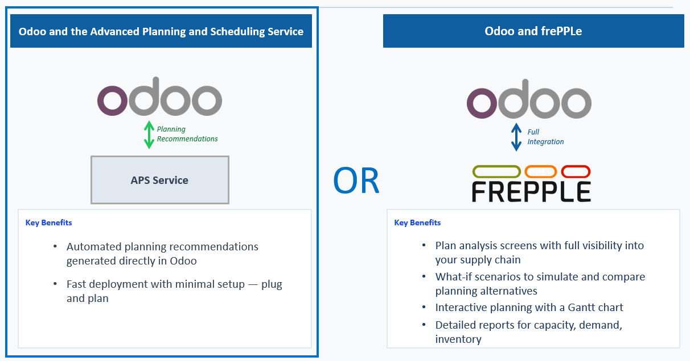

Using the connector with the Advanced Planning and Scheduling Service
---------------------------------------------------------------------

* | **Overview**
  | Odoo users can use the frePPLe recommendation screen without a dedicated frePPLe instance.
    When this feature is enabled, your Odoo data is sent to the Advanced Planning and Scheduling Service at
    https://odoo.frepple.com, a plan is generated on that server, and the recommendations are
    sent back to your Odoo instance. No dedicated frePPLe installation or subscription is required.

* | **Data privacy**
  | We understand that sending business data to an external server is a sensitive matter.
    Here is what happens with your data when using the Advanced Planning and Scheduling Service:

    * Your data is used **exclusively** to generate the plan. It is not used for any other purpose.
    * Your data is **deleted immediately** after the plan has been generated and the recommendations
      have been sent back to Odoo.
    * **No backups, snapshots, or copies** of your data are made at any point during the process.
    * We do **not** retain, analyze, or share your data in any way beyond the plan generation.

* | **Configuration**
  | To enable this feature, go to the frePPLe settings in Odoo and set the following parameters:

    * **frePPLe server**: ``https://odoo.frepple.com``
    * **Webtoken key**: ``advanced_planning_and_scheduling_service``

    Your Odoo instance must also be accessible from the internet. The advanced planning and scheduling service needs to
    reach your Odoo instance to send the recommendations back. Local or private network
    installations that are not exposed to the internet will not work with this feature.

* | **Cost and availability**
  | Hosting and operating the Advanced Planning and Scheduling Service has an ongoing cost for frePPLe. This service is
    currently provided **free of charge**, but this may change in the future depending on the
    server load and usage.
