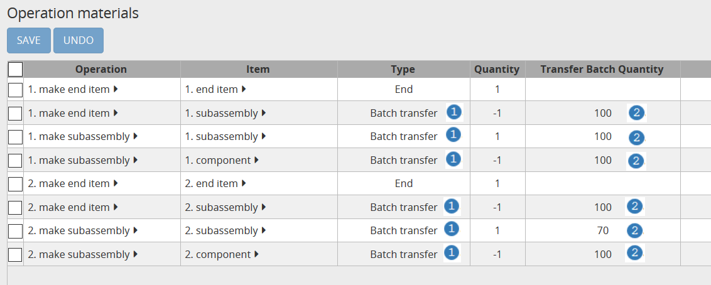

==============
Transfer batch
==============

.. Important::

   | This feature is deprecated.
   | Consider using :doc:`operation dependencies </model-reference/operation-dependencies>` or
     :doc:`operation material offsets </model-reference/operation-materials>` instead.

Transfer batching refers to operations that are planned with some overlap.
The subsequent operation can already start when the previous one hasn't completely
finished yet.

Material is produced and/or consumed in smaller batches at various points during
the operation.

.. image:: _images/transfer-batch.png
   :alt: Two examples of overlapping operations

`Check this feature on a live example <https://demo.frepple.com/transfer-batch/planningboard/>`_

:download:`Download an Excel spreadsheet with the data for this example<transfer-batch.xlsx>`

The model contains 2 examples. The rows in the above screenshot show for each example:

- the loading of the subassembly resource :samp:`A`.

- the inventory between the assembly and subassembly operations :samp:`B`.

- the loading of the assembly resource :samp:`C`.

Modeling transfer batches is straightforward:

- Set the type of the `Operation Materials <https://demo.frepple.com/transfer-batch/data/input/operationmaterial/>`_ records to "Batch transfer" :samp:`1`.

- Populate the field "transfer batch quantity" in the `Operation Materials <https://demo.frepple.com/transfer-batch/data/input/operationmaterial/>`_ table :samp:`2`. This defines
  the amount of material that is produced or consumed per batch.

| The first example models a case where subassemblies are produced in batches of
  100 pieces. The assembly operation consumes these in batches of 100 pieces.
| Notice how both operations run at the same time, and how material is transferred
  between both operations in a just-in-time manner.

| The second example is more complex. The production rate of the subassembly and assembly
  operations is now different, the transfer batch size is also different, and there is a
  calendar defining the working hours.
| Notice how the different duration of both operations creates some minimal and unavoidable
  work-in-progress inventory between both operations. Notice also how the material production
  and consumption is evenly distributed over the working hours of the operations - skipping any
  unavailable periods.

You can easily modify the example. You will obtain different inventory profiles in the
buffer between both operations when you vary the operation duration and/or the transfer batch
quantity.
