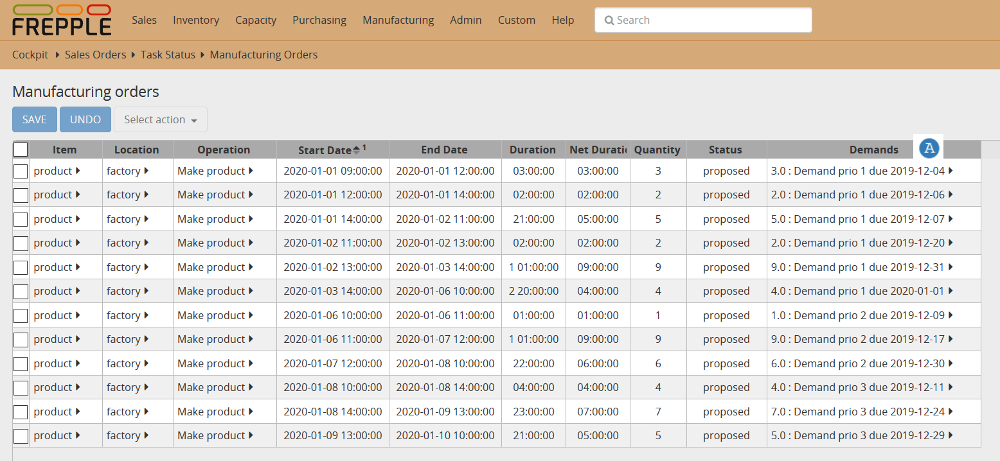

==========
Priorities
==========

FrePPLe's planning algorithm processes demand per demand. One by one, each demands gets planned and reserves the stock, raw materials and capacity it needs.

Demands that are planned first thus get a first chance to search for available supply and are more likely to be planned for delivery at the requested date. In case the total supply is insufficient, the demands that are near the end of the list are more likely to be planned late or short.

FrePPLe orders the demands based on the following attributes:

1. **Priority**

   Lower values get planned first. We first plan all demands of priority 1, then 2, then 3...

2. **Due date**

   In case the priority of 2 demands is the same, the demand is ordered based on the due date. Earlier due dates are planned first.

`Check this feature on a live example <https://demo.frepple.com/demand-priorities/data/input/manufacturingorder/>`_

:download:`Download an Excel spreadsheet with the data for this example<demand-priorities.xlsx>`

In this example we have a number of overdue orders that have to be manufactured on a bottleneck resource.
If we sort the manufacturing orders by start date (current date in the example is 2020-01-01),
we will notice that their pegged demand reflects the ranking criteria described above :samp:`A`.

