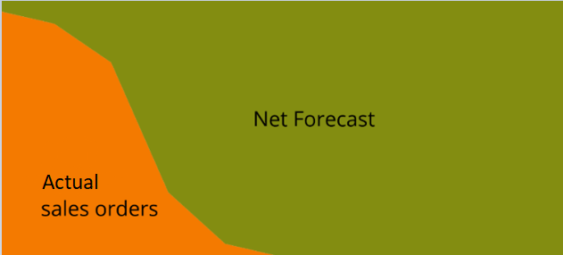
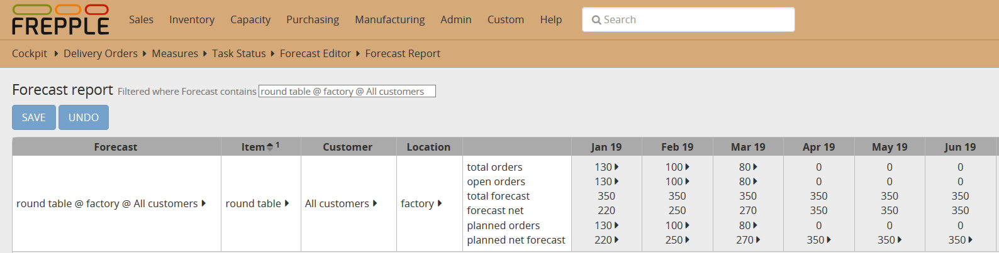
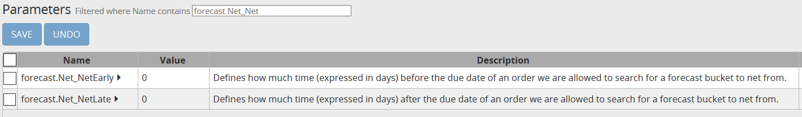
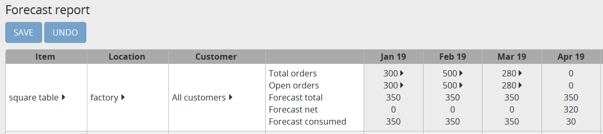

================
Forecast netting
================

Forecast netting (also called forecast consumption) is a calculation to reconcile
forecasted demand and actual sales orders in a single, integrated demand.

The demand across the planning horizon will have 3 distinct regions. The
horizons vary across industries and can also vary by product (e.g. make-to-stock,
make-to-order and configure-to-order products).

1. | Far out in the future, we have **only forecasted demand** to plan.

2. | In the short term, we have **only sales orders** to plan.

3. | There is a period in the planning horizon where **sales orders and forecast
     both exist**. This is where the forecast netting process plays an important role.
   | Planning the *"sales orders + gross forecast"* would double-count some demand 
     (since it ignores the fact that sales orders are already anticipated in the
     gross forecast). 
   | Instead we want to plan the *"sales orders + the remaining part of the forecast
     not realized yet as sales orders"*. The calculation of this "remaining forecast"
     is called forecast netting or forecasting consumption.

The end result after the forecast netting is a consistent demand signal that we
can use to plan across the complete planning horizon.

.. rubric:: Basic example of a round table

`Check this feature on a live example <https://demo.frepple.com/forecast-netting/forecast/?mode=table>`_

:download:`Download an Excel spreadsheet with the data for this example<forecast-netting.xlsx>`

We can see from above picture that actual sales orders are consuming from the 
gross forecast and that results in the net forecast.

+------------------------+------------+-----------+-----------+
| Round table            | Jan        | Feb       | Mar       |
|                        |            |           |           |
+========================+============+===========+===========+
| Actual sales orders    | 130        | 100       | 80        |
+------------------------+------------+-----------+-----------+
| Gross Forecast         | 350        | 350       | 350       |
+------------------------+------------+-----------+-----------+
| Net Forecast           | 220        | 250       | 270       |
+------------------------+------------+-----------+-----------+

Example of a round table produced at factory for 2 different customers with a
forecast calculated at 'All customers' level:

Current date is Jan, 15 2019

Total forecast for January 2019: 350

Actual orders for January 2019: 130

We want to be sure that the actual sales orders for January will be planned (this is quantity 130)
but we also want to plan 350-130=220 of net forecast.

Similarly, net forecast for February 2019 is 350-100=250 and 350-80=270 for March 2019.

Below is a screenshot of the forecast report where net forecast details can be found:

   
From April month, no sales orders have been received so far and the solver only has the net forecast 
(which is equal to the forecast total as no sales order consumes the forecast) to plan.

.. rubric:: **Advanced example of a square table**

Let's consider now the example of a square table with following demand characteristics:

+------------------------+------------+-----------+-----------+-----------+
| Square table           | Jan        | Feb       | Mar       | Apr       |
|                        |            |           |           |           |
+========================+============+===========+===========+===========+
| Actual sales orders    | 300        | 500       | 280       | 0         |
+------------------------+------------+-----------+-----------+-----------+
| Gross Forecast         | 350        | 350       | 350       | 350       |
+------------------------+------------+-----------+-----------+-----------+
| Net Forecast           | 50         | 0         | 70        | 350       |
+------------------------+------------+-----------+-----------+-----------+

We can immediately see that the actual sales orders for February are beyond the gross
forecast computed for that month (500 of sales orders vs 350 of gross forecast) so
the net forecast for that month is 0.

FrePPLe allows the sales orders to consume from future or past buckets.
This is controlled by 2 parameters:

   
The default value for these parameters is 0 but if we set them to 30 and regenerate the plan,
the algorithm can consume forecast from previous or next time bucket.

Below is a screenshot of the forecast report:

Let's take a step by step analysis of the calculation:

1. | First, the netting process will net the sales orders of January 2019
     and below is the result after that netting:

   +------------------------+------------+-----------+-----------+-----------+
   | Square table           | Jan        | Feb       | Mar       | Apr       |
   |                        |            |           |           |           |
   +========================+============+===========+===========+===========+
   | Actual sales orders    | 300        |           |           |           |
   +------------------------+------------+-----------+-----------+-----------+
   | Gross Forecast         | 350        | 350       | 350       | 350       |
   +------------------------+------------+-----------+-----------+-----------+
   | Net Forecast           | 50         | 350       | 350       | 350       |
   +------------------------+------------+-----------+-----------+-----------+

2. | Then the netting process will net the sales from February 2019. 

   | Because there is more sales orders than gross forecast for that month, frePPLe
     will consume first the 350 from February 2019, then (as parameters forecast.Net_NetEarly
     and forecast.Net_NetLate allow it) the 50 from January 2019 and finally 100
     from March 2019, ending in this situation:

   +------------------------+------------+-----------+-----------+-----------+
   | Square table           | Jan        | Feb       | Mar       | Apr       |
   |                        |            |           |           |           |
   +========================+============+===========+===========+===========+
   | Actual sales orders    | 300        | 500       |           |           |
   +------------------------+------------+-----------+-----------+-----------+
   | Gross Forecast         | 350        | 350       | 350       | 350       |
   +------------------------+------------+-----------+-----------+-----------+
   | Net Forecast           | 0          | 0         | 250       | 350       |
   +------------------------+------------+-----------+-----------+-----------+

3. | Finally the netting process will net the sales from March 2019. FrePPLe will
     consume the remaining 250 from March 2019 and 30 from following month
     ending in the same state as above screenshot of the forecast report:

   +------------------------+------------+-----------+-----------+-----------+
   | Square table           | Jan        | Feb       | Mar       | Apr       |
   |                        |            |           |           |           |
   +========================+============+===========+===========+===========+
   | Actual sales orders    | 300        | 500       | 280       | 0         |
   +------------------------+------------+-----------+-----------+-----------+
   | Gross Forecast         | 350        | 350       | 350       | 350       |
   +------------------------+------------+-----------+-----------+-----------+
   | Net Forecast           | 0          | 0         | 0         | 320       |
   +------------------------+------------+-----------+-----------+-----------+
