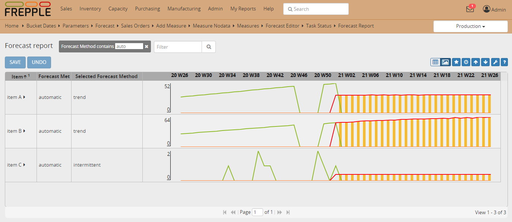

===========================================
Forecasting with missing data and stockouts
===========================================

The sales history we use to compute a statistical may have missing or
unreliable data which we need to account for.

| A typical use case is an item that has a *stockout*. The item isn't available
  on the shelf of your store for some time, and sales during that period will
  obviously be zero.
| The absence of any sales however doesn't mean there is no customer demand for 
  this item. We want to avoid that the zero-demand periods incorrectly pull down
  the statistical forecast.

`Check this feature on a live example <https://demo.frepple.com/forecast-with-missing-data/forecast/>`_

:download:`Download an Excel spreadsheet with the data for this example <forecast-with-missing-data.xlsx>`

* | This example shows 2 items with an identical sales history. A period
    without demand is obvious on the graph.
  | On item A we have run the standard statistical forecast out-of-the-box. 
  | On item B we have marked the periods with a stockout as no-data points.

* | The item A without any special correction show a significant decrease in the
    statistical forecast.
  | The periods without sales have skewed the forecast calculation (and potentially
    also the selection of the best forecast method).

* | The item B has the periods without sales marked explicitly as no-data periods.
  | The forecast algorithm will internally guess the sales for those periods, and 
    as a result the forecast calculation is no longer distorted.

  .. image:: _images/forecast-with-missing-data-2.png
     :alt: No-data flag for missing data points
    
* | The third item C also has periods without demand in its history.
  | However, this is a slow moving item and a period without sales is not exceptional 
    for this item. It would not be correct to mark these as no-data points.
