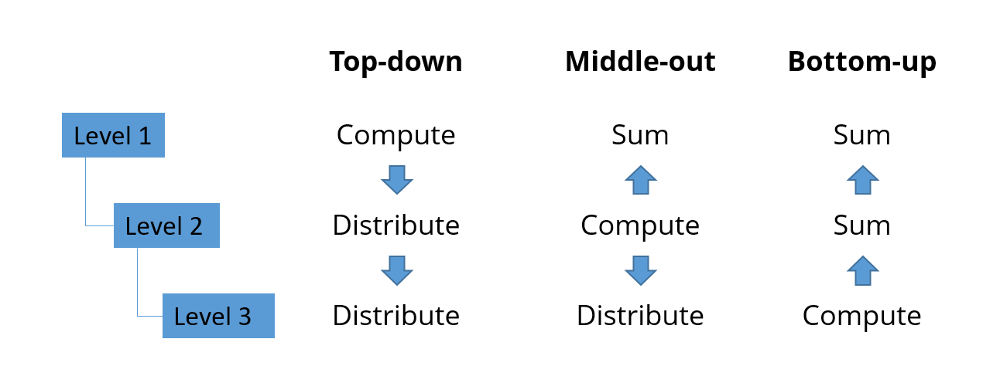

======================
Middle-out forecasting
======================

In a dataset with deep item, location and customer hierarchies choosing the correct
level to compute the statistical forecast is important to get an accurate forecast.

When the statistical forecast is calculated at a very detailed level, the data may be
too sparse to accurately and correctly detect trends and seasonality.

And when the forecast is calculated at a very high level, we may not be accurately
distinguish demand patterns that are specific to a subset of the items, locations
or customers.

This example model illustrates bottom-up, top-down and middle-out forecasting.

`Check this feature on a live example <https://demo.frepple.com/middle-out-forecast/forecast/editor/>`_

:download:`Download an Excel spreadsheet with the data for this example <middle-out-forecast.xlsx>`

* | This example uses identical historical sales at 2 different locations.
  | The level in the item hierarchy where the statistical forecast is calculated is
    different at these locations.

* | **Bottom-up forecasting**

  | The forecast is computed for the items A11, A12... etc and then aggregated to
    the higher levels subgroup A1, group A...

  | At the item and subgroup levels the history is sparse and it is not possible
    to detect any trend. Looking at the group level, we can see that the forecast
    is pretty different from the recent history.

  | The
    `forecast report <https://demo.frepple.com/middle-out-forecast/forecast/?location__name__contains=bottom>`__
    and the
    `forecast editor <https://demo.frepple.com/middle-out-forecast/forecast/editor/>`__
    are good screens to review the results.

  .. image:: _images/middle-out-forecast-1.png
     :alt: Top-down forecasting

* | **Middle-out forecasting**

  | The forecast is now computed at the group level for group A and group B. The
    resulting forecasting is then disaggregated to the lower levels.

  | The result middle-out forecast reflects the recent trend much better than
    the bottom-up forecast.

  | The
    `forecast report <https://demo.frepple.com/middle-out-forecast/forecast/?location__name__contains=middle>`__
    and the
    `forecast editor <https://demo.frepple.com/middle-out-forecast/forecast/editor/>`__
    are good screens to review the results.

  .. image:: _images/middle-out-forecast-2.png
     :alt: Top-down forecasting

* | To configure the forecasting level, you need to populate the
    `forecast table <https://demo.frepple.com/middle-out-forecast/data/forecast/forecast/>`__
    table correctly.

  | To enable bottom-up forecasting, you create a record at the lowest level
    where you want the forecast to be computed. The forecast method is "automatic"
    (or any other method different from "aggregate").

  | To enable middle-out forecasting you also need to create a forecast record
    for a higher level in the hierarchy, and set its forecast method to
    "automatic" (or any other method different from "aggregate").
    Calculated forecast at higher level will be distributed proportionally to
    calculated forecast at lower level.
  | You can only enable the middle-out forecast at a single higher level.
  | Note that the "planned" field of this forecast record is normally set to
    "false". We would be double-planning the same forecasted demand if the both
    the low-level and high-level forecast are planned.

  .. image:: _images/middle-out-forecast-3.png
     :alt: Forecasts
