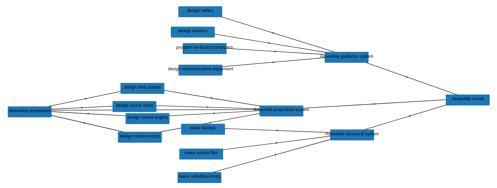

======================
Operation Dependencies
======================

This example model illustrates how frepple can be applied to a project-oriented business.

This example model has NO bill of materials and NO intermediate items to define the
different levels in the product structure.

Instead, this model uses dependencies between operations. The relationship between the
operations accounts for:

- | A blocked-by relation between operations to define which operation must be completed
    before the other.

- | A quantity between the different operations.
  | By default both operations have the same quantity, but you can also configure a
    different quantity for the for blocked-by operations.

- | A hard safety lead time between the operations.
  | This represents a minimum delay between both operations. This time is a hard
    constraint and is used to model eg a cool-down, curing or QA-control time.

- | A safety lead time between the operations.
  | This represents a desired delay between both operations. The algorithm will
    try to generate a plan that respects this time, but in case of a late delivery
    of the sales order this time will be compressed.

The picture below summarizes the product structure of this example.

`Check this feature on a live example <https://demo.frepple.com/operation-dependency/data/input/operationdependency/>`_

:download:`Download an Excel spreadsheet with the data for this example<operation-dependency.xlsx>`

Here is a step by step guide to explore the example:

* | There are 2 projects to be planned. They are represented as sales orders, each
    with a different due date.

  | Note the use of the batch-field. It allows us to keep the manufacturing orders
    of each project separated.

* | Each demand specifies an operation that defines the final step in the project.
  | The "operation dependency" table defines the predecessor steps that are needed
    to complete the project.
  | These dependencies replace the bill of material of the project.

* | The operation material and operation resource tables are used to define the
    material and capacity needs of each operation.

* | The production plan of the project is visible as the plan of your demands.

  .. image:: _images/operation-dependency-2.png
      :alt: Delivery plan of a project

* | The resource report and the purchase order screen show the material
    and capacity requirements of your project.
