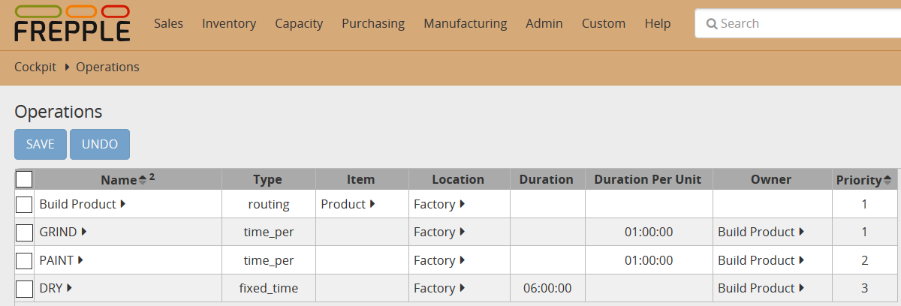

==================
Routing operations
==================

It is possible in frePPLe to declare an operation of type routing.
This operation type represents a set of suboperations that must be run in sequence.
Routing operations have following properties:

- It is not possible to define a buffer between two suboperations of a routing operation.

- Each suboperation can consume from one or more buffers.

- Only final suboperation can produce a buffer.

- Each suboperation must be an operation of type time per or fixed time.

- Each suboperation can be connected to one or more resources as any other time per or fixed time operation.

.. image:: _images/routing.png
   :alt: An example of a routing

In the above example, four operations have to be defined in the operation table :

* An operation named "Build Product" of type "routing". By declaring this operation as a routing operation, 
  you are modeling a virtual operation that is actually composed of other (real) operations in sequence.
  The **item** field of the operation table has to be filled with the produced item of the routing: 
  *Product* in our example. 

* An operation of type time_per named "GRIND" to grind the raw product. 
  The **item** field of the operation table must be empty. The owner field should refer to the routing this 
  operation belongs to. The priority corresponds to the operation sequence and should be equal to 1
  as this is the first operation of the routing.

* An operation of type time_per named "PAINT". The **item** field of the operation table must be empty.
  This operation follows the grinding operation and requires paint pots. The owner field should refer to the routing this 
  operation belongs to. The priority corresponds to the operation sequence and should be equal to 2
  as this is the second operation of the routing.

* An operation named "DRY". That is an operation of type fixed_time as whether one or a hundred parts have to dry,
  it is going to take the same time. The **item** field of the operation table must be empty. The owner field should refer to the routing this 
  operation belongs to. The priority corresponds to the operation sequence and should be equal to 3
  as this is the third operation of the routing.

Last but not least, table operationmaterial should be populated. Any operation (except the rouing operation) can consume items 
(though this is of course not mandatory) and only the last
suboperation in the sequence will produce an item :

**Operationmaterial table:**

===================  ================= ==========
Operation            item              quantity  
===================  ================= ==========
GRIND                Raw Product       -1
PAINT                Paint pot         -1
DRY                  Product           1
===================  ================= ==========

`Check this feature on a live example <https://demo.frepple.com/operation-routing/data/input/operation/>`_

:download:`Download an Excel spreadsheet with the data for this example<operation-routing.xlsx>`

Looking at the `Manufacturing Orders <https://demo.frepple.com/operation-routing/data/input/manufacturingorder/>`_ table, 
we will find 4 records each time a routing operation is run:

.. image:: _images/operation_routing_mo.png
   :alt: Manufacturing orders for a routing operation
   
* The routing operation with its start date (start date of its first suboperation) and its end date (end date of its last suboperation) :samp:`A`.
* Each suboperation with its start date and end date :samp:`B`.
