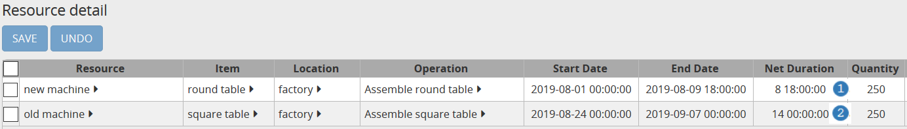

===================
Resource efficiency
===================

In many industries, the same operation can be performed by different machines
or operators. The operation duration can vary with the assigned resource.

Examples are:

* The new packaging line is 20% faster than the old packaging line.

* A skilled operator completes the operation 10% faster while a rookie will
  take 20% longer

* The new production will be 10% slower in the first months after its
  introduction, and then will be able to produce at the standard operation
  time.

The standard operation duration is modelled at the operation level (with the
"fixed duration" and "duration per" fields). The efficiency of a resource is
defined at the resource level, and it can vary over time.

The efficiency of a resource is expressed as a percentage (default is 100%) that will extend or shrink
the duration of a manufacturing order if that resource is picked.

The higher the percentage, the less time a manufacturing order will take (manufacturing orders performed
by a resource with 200% of efficiency will take half the time of that same manufacturing order if it had
been performed with a 100% efficiency resource).

The modeling outlined in this example applies only to situations where **the same
efficiency factor is applicable for all operations** the resource can perform.
When the **effiency varies by product**, you should use an alternate operation
instead (see example on `alternate operations <../../../examples/operation/operation-alternate.php>`_).

.. rubric:: Example

`Check this feature on a live example <https://demo.frepple.com/resource-efficiency/data/input/resource/>`_

:download:`Download an Excel spreadsheet with the data for this example<resource-efficiency.xlsx>`

* "old machine" is slow and has 75% of efficiency.

* "new machine" is fast and has 120% of efficiency.

* machine park is the parent resource of both resources and will be used in
  `Operation Resources <../../../model-reference/operation-resources.php>`_ table.

.. image:: _images/resources.png
   :alt: old and new machine resources.

The 2 assemble operations are time_per operations with a fixed duration of 2 hours and 1 hour per produced item.

.. image:: _images/operations.png
   :alt: Time per operations.

As both "new machine" and "old machine" can be used to assemble the two produced items of the
example (a round table or a square table), we need to declare the parent resource
in the `Operation Resources <../../../model-reference/operation-resources.php>`_ table.
This lets the solver know that any resource of the group can perform the task,
see `Resource alternate <../../../examples/resource/resource-alternate.php>`_ example for more details.

.. image:: _images/operationresources.png
   :alt: Operation resources table.

When executing a constrained supply planning, frePPLe will create 2 manufacturing orders
to plan the 2 sales orders (one sales order for 250 square tables and another one for 250 round tables).

Both resources will be used and we can now have a look at the manufacturing order durations in the
`Resource Detail <https://demo.frepple.com/resource-efficiency/data/input/operationplanresource/>`_ report:

We can see that, even if the 2 operations have the same duration per piece, the manufacturing order
executed with the "new machine" has a shorter duration (8 days and 18 hours) :samp:`1` than the manufacturing order run on the
"old machine" (14 days) :samp:`2`.
