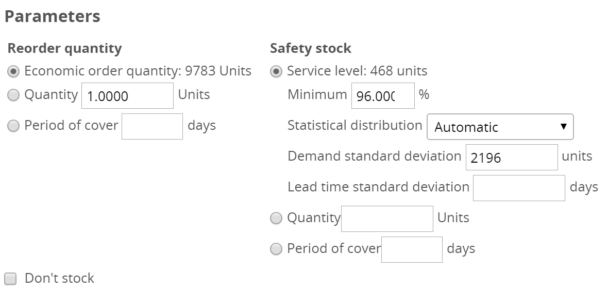
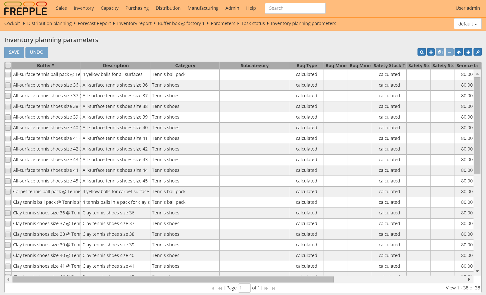

=========================
Inventory planning module
=========================

.. Important::

   This module is only available in the Enterprise Edition.

This module allows the calculation of the optimized reorder quantities
and safety stocks for all buffers. This is an important aspect of your 
planning process, as safety stocks are required to:

* | Safety stocks are required to meet the expected service level of 
    your customers. 
  | When customer delivery times are shorter than the production or purchasing
    lead times, inventories are required to cover the expected demand over
    the lead time and its variability.
  
* | Safety stocks covers for variability on the supply side.
  | Supplier purchasing lead times and manufacturing times have a level of
    variability that needs to be planned for to support a smooth progress of 
    all activities.   

This module computes these safety stock and reorder quantities, which are then
used by the planning algorithm to generate matching replenishment plans.

The module offers the following functionality to compute these values. In the
distribution planning screen these parameters are shown to the user as follows:

      
Calculation of the reorder quantity
-----------------------------------
  
The reorder quantity represents the quantity of material to be purchased
per purchase order.

We provide three different ways to compute it. In the distribution planning 
screen the planner has the capability to override the value computed by the
system for specific time periods.

* **Economic order quantity**

 A reorder quantity can be computed that finds the best compromise
 between the cost of carrying inventory and the handling cost associated with
 each purchase order. 
 
 See https://en.wikipedia.org/wiki/Economic_order_quantity for the background.
 
 The parameter *inventoryplanning.fixed_order_cost* defines the cost of
 processing an order. The parameter *inventoryplanning.holding_cost*
 define the percentage of the item cost involved in storing the material for
 one year in your warehouse. 
 
 Since the forecast varies by period, the economic order quantity will 
 be computed seperately for each period in the planning horizon. 

* **Fixed quantity**

  This freezes the reorder quantity to a fixed value for all time periods. 
  This can be useful eg when you order a pallet or a container at a time. 

* **Period of cover**

  Using this method the reorder quantity is computed to cover the expected 
  demand for the specified time fence.
 
  Since the demand varies over time, the reorder quantity will also vary
  for each period in the planning horizon.
  
Calculation of the safety stock
-------------------------------

The safety stock is the lowest point below which we don't plan the inventory
to drop. It is the moment right before we expect the next replenishment to
come in.

The safety stock is related to the reorder point with the relation:
   
   reorder point = safety stock + demand during the replenishment lead time
   
We provide three different ways to compute the safety stock. In the 
distribution planning screen the planner has the capability to override the 
value computed by the system for specific time periods.

* **Service level**
 
 The module can compute the safety stock required to obtain a certain 
 service level.

 The calculation is based on the following data elements:
 
 - Target service level
 
   Obviously, higher service level require a higher safety stock level.
 
 - Statistical distribution applicable to the demand
 
   In most case you can leave it to the system to choose automatically 
   between a Gaussian (or Normal), Poisson or Negative Binomial distribution
   type. The automatic selection logic is based on the forecast value and
   the demand deviation.
   
 - Standard deviation of the demand history. 
 
   Spiky and irregular demands patterns require a higher safety stock level
   to reach the same service level.
  
   FrePPLe computes this standard deviation from the demand history, but a
   planner can override this value.
   
 - Standard deviation of the lead time
 
   Similar to demand variability, also variability in the replenishment lead 
   times result in higher safety stock levels. The more unreliable the supply,
   the higher the safety stock required to reach a given service level.
 
* **Fixed quantity**

  This set a safety stock at a fixed value for all time periods. This can be useful eg when you order a pallet or a container at a time. 

* **Period of cover**

  Using this method the safety stock is computed as the expected average 
  demand over a specified time fence.
 
  Since the demand varies over time, the safety stock will also vary
  for each period in the planning horizon.
  
Don't stock flag
----------------

As a special case users can flag certain item-locations to be non-stockable.
The safety stock is then set to 0, and the reorder quantity is set to 1.

Note that this flag does NOT mean the item can't have any demand. If there 
is demand on a buffer with this flag set, we will create a replenishment plan 
where each demand has a matching supply of the same quantity on the same day.   
      
Maintenance of inventory planning parameters
--------------------------------------------

For editing the parameters of a single item location, the distribution planning
screen is the most appropriate screen. When a parameter is changed you can 
recalculate on-the-fly the forecast, inventory plan and the resulting 
replenishment transactions.

See :doc:`this page </user-guide/plan-analysis/distribution-planning>` for full information.  

Mass maintenance of the inventory planning parameters is possible from a
separate screen, available in the "inventory" menu group. Using this screen
you can edit the parameters directly into the table, export them as Excel spreadsheet
or import an Excel spreadsheet.

