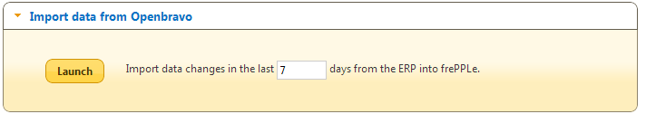
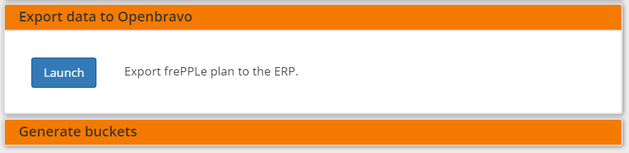
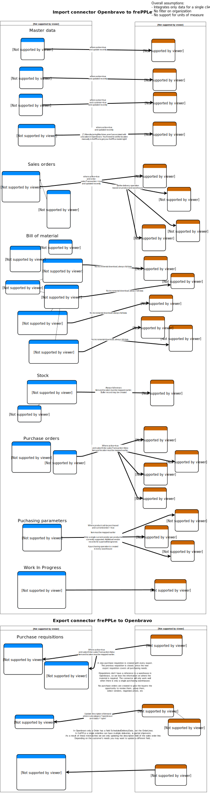

===================
Openbravo connector
===================

.. raw:: html

   <iframe width="640" height="360" src="http://www.youtube.com/embed/CBDaY4RUH58" frameborder="0" allowfullscreen=""></iframe>

FrePPLe provides an integration with `Openbravo <http://www.openbravo.com>`_, a
leading open source agile ERP system.

The connector provides the following functionality:

* Two-way integration:

  * Synchronizes the frePPLe database with items, locations, bill of materials,
    routings, resources, sales orders, customers, inventory, production orders,
    purchase orders from Openbravo.

  * Uploads new production requirements, purchase requisitions and expected
    delivery date of sales orders from frePPLe to Openbravo.

* Uses the standard XML web service to access Openbravo.

* For optimal performance the connector allows net-change download. Only the
  objects that have been created or changed in Openbravo within a certain time
  frame are extracted.

* You can still maintain additional data in the frePPLe user interface. I.e.
  Openbravo doesn’t need to be the only source of data for your model.

* Easy to customize.

* The connector has been developed with Openbravo 3.0.

**Configuring the connector**

* | **Edit the configuration file djangosettings.py**
  | The file is found under /etc/frepple (linux) or <install folder>\bin\custom
    (Windows).
  | Assure that the freppledb.openbravo is included in the setting
    INSTALLED_APPS which defines the enabled extensions. By default
    it is enabled.

* | **Configure the following parameters**
  | In the frePPLe user interface, the menu item “admin/parameters” opens a
    data table to edit these.

  * openbravo.host: host where the Openbravo web service is running

  * openbravo.user: Openbravo user used to for the connection

  * | openbravo.password: Password for the connection
    | For improved security it is recommended to specify this password in the
      setting OPENBRAVO_PASSWORDS in the djangosettings.py file rather then this
      parameter.

  * | openbravo.date_format: Date format for openbravo webservice filter
    | Date format defaults to  %Y-%m-%d (i.e. YYYY-MM-DD) but can here be changed
      to other formats like %m-%d-%Y (i.e. MM-DD-YYYY).

**Importing data from Openbravo to frePPLe**

You can run the import interface in 2 ways:

* | **Interactively from the frePPLe user interface.**
  | The execute screen has a specific section where you can launch the import
    connector.
  | You can specify the number of days of recent changes you want to extract
    from Openbravo.

* | **From the command line script.**
  | The script is especially handy when you want to run the interface
    automatically.
  | Issue one of the commands below.

  ::

    frepplectl openbravo_import
    frepplectl openbravo_import --delta=7

**Exporting data from frePPLe to Openbravo**

You can run the connector in 2 ways:

* | **Interactively from the frePPLe user interface.**
  | The execute screen has a specific section where you can launch the export
    connector.

* | **From the command line.**
  | Issue the command below. The script is especially handy when you want to
    run the interface automatically.

  ::

     frepplectl openbravo_export

**Mapping details**

The connector doesn’t cover all possible configurations of Openbravo and
frePPLe. The connector is very likely to require some customization to fit
the particular setup of the ERP and the planning requirements in frePPLe.

:download:`Download mapping documentation as SVG <_images/openbravo-integration.svg>`

