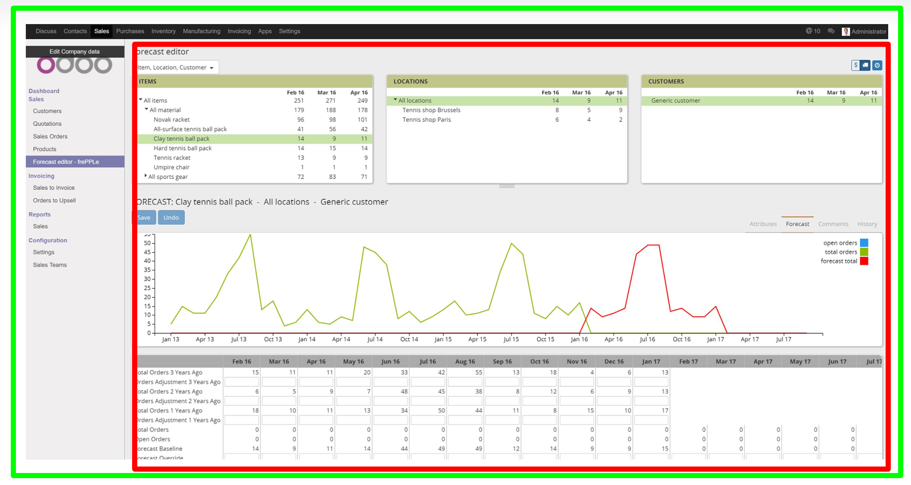
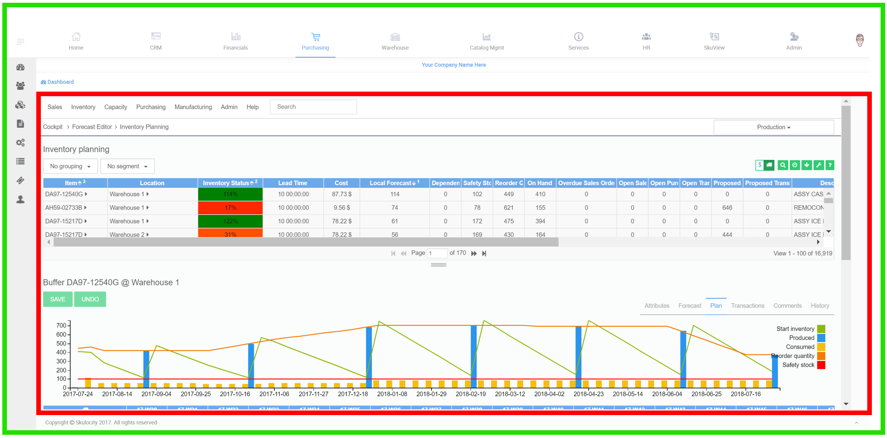

==============
User interface
==============

It is possible to closely integrate frePPLe's user interface in other web applications. 

To create a exceptional and powerful user experience, frePPLe provides:

- | Ability to authenticate user with a web token (see https://jwt.io/introduction/) issued
    by another web application.
  | Users only need to log in once. The user authentication is handled your web application, 
    which forwards the credentials to frePPLe in a securely encrypted token. 
  
- Ability to display frePPLe in a iframe, with or without its navigation bar.

- Ability to completely customize the look and feel of the frePPLe user interface. You
  can create custom themes to match your web application. 
  See http://getbootstrap.com/customize/ and 
  :doc:`../../developer-guide/user-interface/creating-a-custom-theme`

| Below are two examples of such an integration.
| The green boundary is the complete user interface, in this case Odoo (see https://odoo.com)
  and skulocity (see http://skulocity.com).
| The content of the red area is generated by frePPLe.

The implementation requires the following steps:

- The external application needs to **generate a webtoken**, following the see JWT JSON Web 
  Token specification: https://jwt.io/introduction/
  
  The web token specifies:
  
    - The user that is authenticated. The user must be defined
      in frePPLe and his/her role and permissions within frePPLe
      need to be defined: See below. 
      
    - | The expiration time until which the token is valid, expressed as
        seconds since Jan 1st 1970 GMT. The site https://www.epochconverter.com/
        provides a convenient check on these values.
      | A token should normally be valid 1 to 2 hours after its generation.
      
    - The navbar argument specifies whether frePPLe should render
      its navigation header or not. In most case you'll want to hide it.
     
  Below is an example code snippet using the Python PyJWT library (see 
  http://pyjwt.readthedocs.io/en/latest/). https://jwt.io/#libraries 
  contains links to implementations of the JWT specification in many other 
  programming languages.
  
  ::
     
     import jwt
     import time
     webtoken = jwt.encode(
       {
       'exp': round(time.time()) + 600,    # Validity of the token
       'user': USERNAME,                   # User name
       'navbar': False                     # Whether or not frePPLe should render
                                           # its navigation bar or not
       },
       'MY_SECRETKEY',    # The shared secret between frePPLe and your application
       algorithm='HS256'
       ).decode('ascii')  

- | The external application needs to **use an iframe to display frePPLe's content**.
  | Note how the web token is added as a URL argument to the frePPLe web browser. (As a 
    future enhancement we might also allow putting the token in a HTPP header.)
  | If your application is running under HTTPS, frePPLe will also need to be configured
    to use HTTPS. Otherwise browsers will refuse to display frePPLe's unencrypted data
    on the page.
  
  ::
  
     <iframe src="https://FREPPLE_URL/?webtoken=WEBTOKEN" width="100%" height="100%"
       marginwidth="0" marginheight="0" frameborder="no" scrolling="yes" />

- | On frePPLe's side the **shared secret needs to be configured** in the file djangosettings.py.
  | By default it is set to the secret key of the frePPLe application. It is more secure to
    generate a separate secret key for the web token authentication without sharing 
    frePPLe's own internal secret key.
  
  ::
  
     ...
     DATABASES = {
       'default': {
          ...
          SECRET_WEBTOKEN_KEY: 'MY_SECRETKEY',
          ...
          }
       }
     ...     

- **Each user accessing frePPLe will still need to be defined in frePPLe** and his/her
  role and permissions will need to be defined. See details: 
  :doc:`../../user-guide/user-interface/getting-around/user-permissions-and-roles`
  (As a future enhancement, we could automatically create the user and assign the role. This
  requires the web token frePPLe receive to include the user's role.)
 