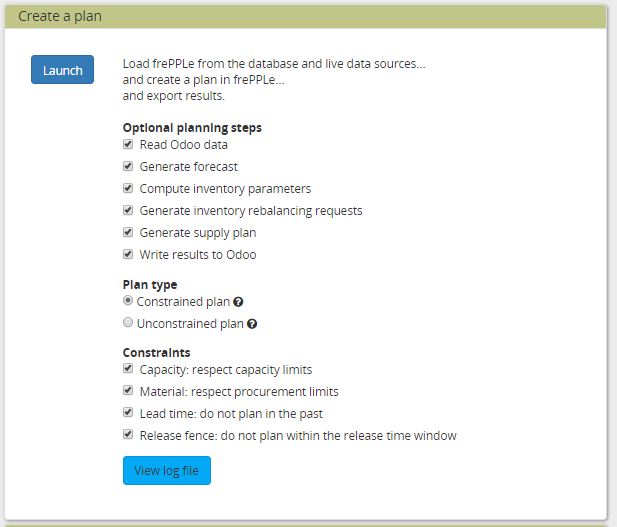
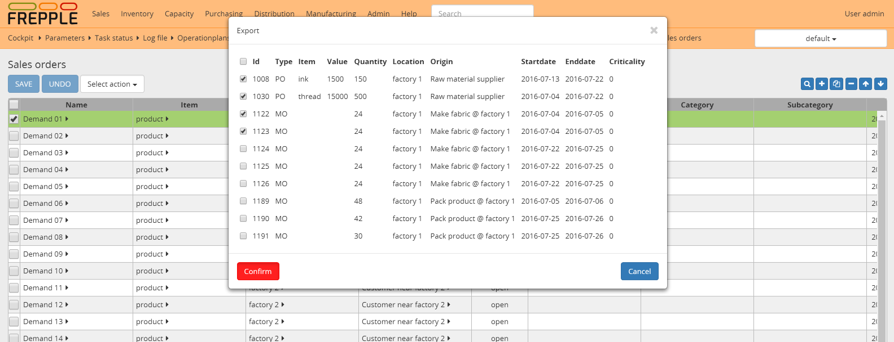

==============
Odoo connector
==============

.. raw:: html

   <iframe width="640" height="360" src="https://www.youtube.com/v/dXOcVccLkPE" frameborder="0" allowfullscreen=""></iframe>

FrePPLe provides an integration with the Odoo (formerly known as OpenERP),
a leading open source ERP.

The connector provides the following functionality:

* | Two-way integration.
  | The connector retrieves all master data required for planning from Odoo.
  | The connector publishes the resulting plan back to Odoo, either a)
    automatically at the end of the planning run or b) after manual review
    and approval by the planner.

* | Live data integration.
  | The connector reads the data directly from Odoo and writes the results
    back. Compared to replicating data to its own database, this provides
    a more native and tighter integration. It is still possible to save a
    copy of the odoo in the frePPLe database to use the frePPLe user
    interface.

* You can still maintain additional data in the frePPLe user interface.
  I.e. Odoo doesn't need to be the only source of data for your model.

* | Easy to customize.
  | Implemented as an odoo addon module, it is easy to customize the connector
    to your needs.

* The integration has been developed and tested with Odoo v8 and v9.

Here are the slides presented during the Odoo user conference in October 2016.

.. raw:: html

   <iframe src="https://www.slideshare.net/slideshow/embed_code/key/hDESgQ2Xo7spV" width="597" height="486" frameborder="0" marginwidth="0" marginheight="0" scrolling="no" style="border:1px solid #CCC; border-width:1px 1px 0; margin-bottom:5px; max-width: 100%;" allowfullscreen=""> </iframe>

**Overview**

The connector has 2 components:

* | An odoo addon:
  | All mapping logic between the Odoo and frePPLe data models is in this
    module. The results are accessible on the URL http://odoo_host/frepple/xml
    from which the planning engine will read data in its native XML data format
    and to which it will post the results.

* | A frePPLe addon:
  | This module gives frePPLe the capability to connect to Odoo, read the data
    from it, and publish back the results.

**Configuring the connector**

* | **Install the Odoo addon**
  | The addon code is found in the folder contrib/odoo, or you can pick up the
    latest version from github https://github.com/frePPLe/frePPLe/tree/master/contrib/odoo.
  | A different version is required for each version of Odoo.

  The module has the following dependencies: 'procurement', 'product', 'purchase',
  'sale', 'resource', 'mrp', 'sales_order_date', and (optional) 'hr'.

  After installation, you'll find the following additional features in odoo:

  * A web interface called by the frePPLe planning engine. It is accessible at the
    URL http\://<host>:<port>/frepple/xml?database=<db>&language=<language>&company=<yourcompany>

  * A menu item in the warehouse menu to manually recreate the plan.

  * A scheduler task to recreate the plan as a cron job.

  * Extra configuration options in company editing form, as described below.

* | **Deploying in a multi-database odoo environment**
  | When using the connector in a configuration with multiple databases
    the addon needs to be loaded as a server wide module. This is achieved
    by using the option "--load frepple,web,web_kanban" option on the command
    line starting the server.

  In a setup with only a single odoo database this step is not required.

* | **Configure the Odoo addon**
  | The module adds some configuration fields on the company model.
  | Edit these parameters:

  * | Calendar:
    | References a resource.calendar model that is used to define the working
      hours.
    | If left unspecified, we assume 24*7 availability.

  * | Manufacturing location:
    | The connector assumes each company has only a single manufacturing
      location.
    | All bills of materials are modelled there.

  * | Cmdline:
    | Command line launched when the plan generation for a company is launched
      interactively from the user interface.
    | Note that when launched from a scheduler cron job, the command line is
      configured on the job directly.

* | **Edit the frePPLe configuration file djangosettings.py**
  | The file is found under /etc/frepple (linux) or <install folder>\bin\custom
    (Windows).
  | Assure that the freppledb.odoo is included in the setting
    INSTALLED_APPS which defines the enabled extensions. By default
    it is enabled.

* **Configure the frePPLe parameters**:

  * odoo.url: URL of the Odoo server

  * odoo.db: Odoo database to connect to

  * odoo.user: Odoo user for the connection

  * | odoo.password: Password for the connection
    | For improved security it is recommended to specify this password in the
      setting ODOO_PASSWORDS in the djangosettings.py file rather then this
      parameter.

  * | odoo.language: Language for the connection.
    | If translated names of products, items, locations, etc they will be used.

  * odoo.company: Company name for which to create purchase quotation and
    manufacturing orders

  * | odoo.filter_export_purchase_order: Python filter expression for the
      automatic export of purchase orders.
    | The expression gets as arguments 'operationplan' and 'buffer', and it
      should return True if the transaction is to be included in the automated
      bulk export.

  * | odoo.filter_export_manufacturing_order: Python filter expression for the
      automatic export of manufacturing orders.
    | The expression gets as arguments 'operationplan' and 'buffer', and it
      should return True if the transaction is to be included in the automated
      bulk export.

  * | odoo.filter_export_distribution_order: Python filter expression for the
      automatic export of distribution orders.
    | The expression gets as arguments 'operationplan' and 'buffer', and it
      should return True if the transaction is to be included in the automated
      bulk export.

**Running the connector**

You can run the connector in different ways:

* | **Interactively from the frePPLe user interface**
  | The execute screen has checkboxes that allow enabling reading from and
    writing to Odoo.
  | The plan exported to odoo is a subset of the plan which passes
    certain filter conditions. The remaining part of the plan can
    only be exported manually from frePPLe to Odoo: see below.

* | **From the command line**
  | The script is especially handy when you want to regenerate the plan
    automatically.
  | Issue the command below.

  ::

     frepplectl frepple_run --env=odoo_read_1,odoo_write

* | **Interactively from the Odoo menu**
  | Make sure the command line on the company you run for is configured
    correctly.

* | **Automatically with the Odoo cron scheduler**
  | Make sure the command line on the task is configured correctly.

| The connector distinguishes different modes to retrieve data from Odoo. This
  allows us to schedule the extraction of larger and/or slowly changing data
  volumes (eg sales order history over the last few years as required for the
  forecast calculation) from the extraction of data elements that need to be
  retrieved whenever the plan is generated (eg open sales orders, current
  inventory).
| Using the argument odoo_read_1 or odoo_read_2 specific the requested data
  extraction mode. By default all data elements are extracted in mode 1.
  It'll require customization of the Odoo addon to define for which
  data elements you want to use mode 2.

**Incremental export to Odoo**

The connector exports plan data in 2 modes from frePPLe back to Odoo.

* A bulk export is run automatically run when the plan generation
  is finished. See the previous section.

* | An incremental export from the frePPLe user interface for
    individual purchase, manufacturing and distribution
    orders.
  | When selecting a sales order for incremental export a popup window
    is displayed with a list of linked purchase, manufacturing and
    distribution orders.

A typical usage is to automatically export the proposed purchase for
cheap or fast moving items, and let the planner review and approve
the proposed plan for expensive or slow moving items.

.. image:: _images/odoo-approve-export.png
   :alt: Exporting individual transactions to odoo

**Mapping details**

The connector doesn't cover all possible configurations of Odoo and frePPLe.
The connector is very likely to require some customization to fit the particular
setup of the ERP and the planning requirements in frePPLe.

:download:`Download mapping documentation as pdf <_images/odoo-integration.pdf>`

:download:`Download mapping documentation as a spreadsheet <_images/odoo-integration.xlsx>`

.. image:: _images/odoo-integration.jpg
   :alt: odoo mapping details