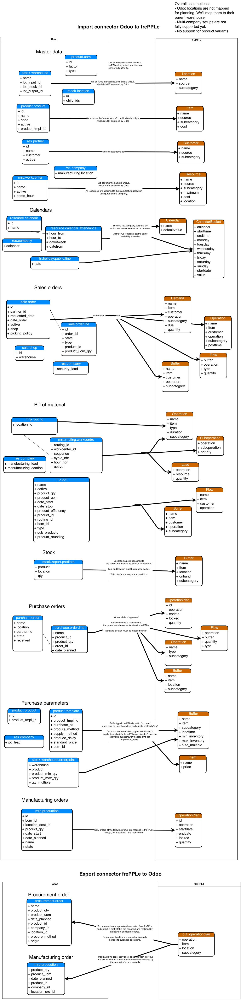

==============
Odoo connector
==============

.. raw:: html

   <iframe width="640" height="360" src="https://www.youtube.com/embed/dXOcVccLkPE" frameborder="0" allowfullscreen=""></iframe>

FrePPLe provides an integration with the `Odoo <https://www.odoo.com/Odoo>`_, a 
leading open source business management suite.

Overview
--------

The connector provides the following functionality:

* | Two-way integration.
  | The connector retrieves all master data required for planning from Odoo.
  | The connector publishes the resulting plan back to Odoo, either a)
    automatically at the end of the planning run or b) after manual review
    and approval by the planner.

* | Live data integration.
  | The connector reads the data directly from Odoo and writes the results
    back. Compared to replicating data to its own database, this provides
    a more native and tighter integration. It is still possible to save a
    copy of the odoo in the frePPLe database to use the frePPLe user
    interface.

* | User interface integration.
  | Users can access frePPLe screens from the Odoo interface, without
    logging in a second application.

* | Easy to customize.
  | Implemented as an odoo addon module, it is easy to customize the connector
    to your needs.

* The integration has been developed and tested with v10 (main development
  focus), v9 (support-only) and Odoo v8 (outdated).

Here are the slides presented during the Odoo user conference in October 2016.

.. raw:: html

   <iframe src="https://www.slideshare.net/slideshow/embed_code/key/hDESgQ2Xo7spV" width="597" height="486" frameborder="0" marginwidth="0" marginheight="0" scrolling="no" style="border:1px solid #CCC; border-width:1px 1px 0; margin-bottom:5px; max-width: 100%;" allowfullscreen=""> </iframe>

Using the connector in Odoo
---------------------------

After installation, users find the following additional features in odoo:

* | The sales menu has a link to the **frePPLe forecast editor screen**.
  | In this screen users can review and edit the sales forecast at 
    different levels in the product, location, customer and time dimensions.
    
  .. image:: _images/odoo-forecast-editor.png
   :alt: Review and edit sales forecast in odoo

  | Note that this screen is only available in the Enterprise Edition of frePPLe. 
    When using the frePPLe Community Edition these links will result in a 
    page-not-found error message. 

* | The inventory menu has a link to the **frePPLe inventory planning screen**.
  | In this screen users can review and edit the stocking policies for
    each item location. 
    
  .. image:: _images/odoo-inventory-planning.png
   :alt: Review and edit safety stock and replenishment policies in odoo

  | Note that this screen is only available in the Enterprise Edition of frePPLe. 
    When using the frePPLe Community Edition these links will result in a 
    page-not-found error message. 

* | The manufacturing menu has a link to the **frePPLe plan editor screen**.
  | In this screen an interactive Gantt chart is shown where users can 
    review the plan and adjust where appropriate. Changes to the plan are
    automatically propagated to predecessor and successor production steps. 
    
  .. image:: _images/odoo-plan-editor.png
   :alt: Interactive Gantt chart in odoo

  | Note that this screen is only available in the Enterprise Edition of frePPLe. 
    When using the frePPLe Community Edition these links will result in a 
    page-not-found error message. 

* The manufacturing menu also contains a link to the complete frePPLe
  user interface.
    
* The manufacturing menu has an extra task to recreate the plan using
  frePPLe.

* A scheduler task to recreate the plan as a cron job.

Using the connector in frePPLe
------------------------------

The odoo integration brings new functionality to the user interface.

* | **Generate the plan with live odoo data and write results to odoo**
  | The execute screen has checkboxes that allow enabling reading from and
    writing to Odoo.
  | The plan exported to odoo is a subset of the plan which passes
    certain filter conditions. The remaining part of the plan can
    only be exported manually from frePPLe to Odoo: see below.

  .. image:: _images/odoo-import-export.png
   :alt: Import from and export to odoo

  | The connector distinguishes different modes to retrieve data from Odoo. This
    allows us to schedule the interfacing of larger and/or slowly changing data
    volumes (eg sales order history over the last few years as required for the
    forecast calculation) from the extraction of data elements that need to be
    retrieved whenever the plan is generated (eg open sales orders, current
    inventory).
  | Using the argument odoo_read_1 or odoo_read_2 specific the requested data
    extraction mode. By default all data elements are extracted in mode 1.
    It requires customization of the Odoo addon to define for which
    data elements you want to use mode 2.

* | An incremental export from the frePPLe user interface for
    individual purchase, manufacturing and distribution
    orders.
  | When selecting a sales order for incremental export a popup window
    is displayed with a list of linked purchase, manufacturing and
    distribution orders.

  | A typical usage is to automatically export the proposed purchase for
    cheap or fast moving items, and let the planner review and approve
    the proposed plan in frePPLe for expensive or slow moving items.

  .. image:: _images/odoo-approve-export.png
   :alt: Exporting individual transactions to odoo

  .. image:: _images/odoo-approve-export-sales-order.png
   :alt: Exporting transactions of a sales order to odoo

Installation and configuration
------------------------------

The connector has 2 components:

* | An odoo addon:
  | All mapping logic between the Odoo and frePPLe data models is in this
    module. The results are accessible on the URL http://odoo_host/frepple/xml
    from which the planning engine will read data in its native XML data format
    and to which it will post the results.

* | A frePPLe addon:
  | This module gives frePPLe the capability to connect to Odoo, read the data
    from it, and publish back the results.
  | It also activates additional menus in the frePPLe user interface.

The section below describes the installation and configuration of these.

* **Configuring the connector - Odoo side**

  * | **Install the Odoo addon**
    | The addon code is found in the folder contrib/odoo, or you can pick up the
      latest version from github https://github.com/frePPLe/frePPLe/tree/<version>/contrib/odoo
      (replace <version> with the frePPLe version you are using).
    | Use the addon from the subfolder matching your Odoo version.
  
  * | **Configure the Odoo server**
    | FrePPLe needs to be loaded as a server wide module. This is achieved
      by updating an option in the Odoo configuration file:
      "server_wide_modules= frepple,web,web_kanban"
  
  * | **Configure the Odoo addon**
    | The module adds some configuration fields on the company model.
    | Edit these parameters:
  
    * | Webtoken key:
      | A secret random string used to sign web tokens for a single signon between
        the Odoo and frePPLe web applications. Choose a string that is long enough,
        random and contains a mix of lower case characters, upper case characters
        and numbers.
        
    * | Calendar:
      | References a resource.calendar model that is used to define the working
        hours.
      | If left unspecified, we assume 24*7 availability.
  
    * | Manufacturing warehouse:
      | The connector assumes each company has only a single manufacturing
        location.
      | All bills of materials are modeled there.
  
    * | Cmdline:
      | Command line launched when the plan generation for a company is launched
        interactively from the user interface.
      | Note that when launched from a scheduler cron job, the command line is
        configured on the job directly.
  
  * | You can run a **quick test** of the above by opening a web browser to the URL
      http\://<host>:<port>/frepple/xml?database=<db>&language=<language>&company=<company>.
      The parameters db and company determine which odoo database to connect to.
    | After providing the login details, an XML document will be displayed with
      the data that frePPLe will read from Odoo.
    

* **Configuring the connector - frePPLe side**

  * | **Edit the frePPLe configuration file djangosettings.py**
    | The file is found under /etc/frepple (linux) or <install folder>\bin\custom
      (Windows).
    | Assure that the "freppledb.odoo" is included in the setting
      INSTALLED_APPS which defines the enabled extensions. By default
      it is disabled.
    | Update the DATABASE section such that the SECRET_WEBTOKEN_KEY setting of each
      scenario is equal to the web token key configured in Odoo.
  
  * **Configure parameters**:
  
    * odoo.url: URL of the Odoo server
  
    * odoo.db: Odoo database to connect to
  
    * odoo.user: Odoo user for the connection
  
    * | odoo.password: Password for the connection
      | For improved security it is recommended to specify this password in the
        setting ODOO_PASSWORDS in the djangosettings.py file rather then this
        parameter.
  
    * | odoo.language: Language for the connection.
      | If translated names of products, items, locations, etc they will be used.
      | The default value is en_US.
  
    * odoo.company: Company name for which to create purchase quotation and
      manufacturing orders
  
    * | odoo.filter_export_purchase_order: Python filter expression for the
        automatic export of purchase orders.
      | This parameter currently not used.
      | The expression gets as arguments 'operationplan' and 'buffer', and it
        should return True if the transaction is to be included in the automated
        bulk export.
  
    * | odoo.filter_export_manufacturing_order: Python filter expression for the
        automatic export of manufacturing orders.
      | This parameter currently not used.
      | The expression gets as arguments 'operationplan' and 'buffer', and it
        should return True if the transaction is to be included in the automated
        bulk export.
  
    * | odoo.filter_export_distribution_order: Python filter expression for the
        automatic export of distribution orders.
      | This parameter currently not used.
      | The expression gets as arguments 'operationplan' and 'buffer', and it
        should return True if the transaction is to be included in the automated
        bulk export.

Data mapping details
--------------------

The connector doesn't cover all possible configurations of Odoo and frePPLe.
The connector will very likely require some customization to fit the particular
setup of the ERP and the planning requirements in frePPLe.

:download:`Download mapping as svg image <_images/odoo-integration.svg>`

:download:`Download mapping as a spreadsheet <_images/odoo-integration.xlsx>`

