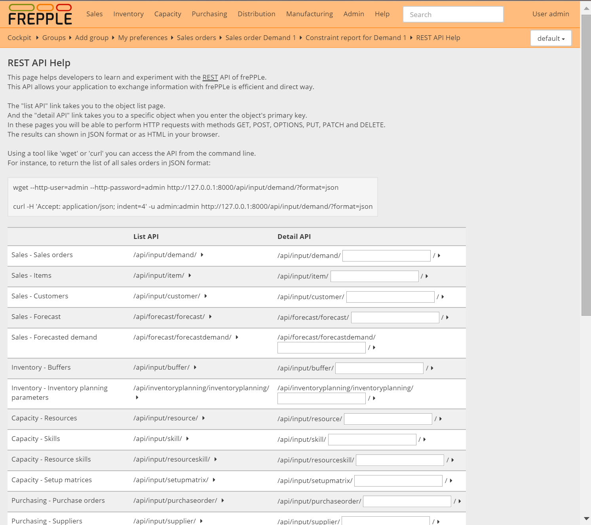

========
REST API
========

FrePPLe provides a state of the art REST API (see https://en.wikipedia.org/wiki/Representational_state_transfer)
for data exchange with other enterprise applications.

Features:

* Fast and efficient.

* Supports multiple formats.

* Open and extendible architecture, leveraging the excellent django REST framework
  from Tom Christie: see http://www.django-rest-framework.org/

When you access Help in the navigation Menu, you will find a API Help entry. This page
allows you to test and experiment with the API from your browser. It shows all URLs and
HTTP methods supported by the API.

.. toctree::
   :maxdepth: 3

   list-api-from-your-browser
   detail-api-from-your-browser
   api-from-the-command-line

