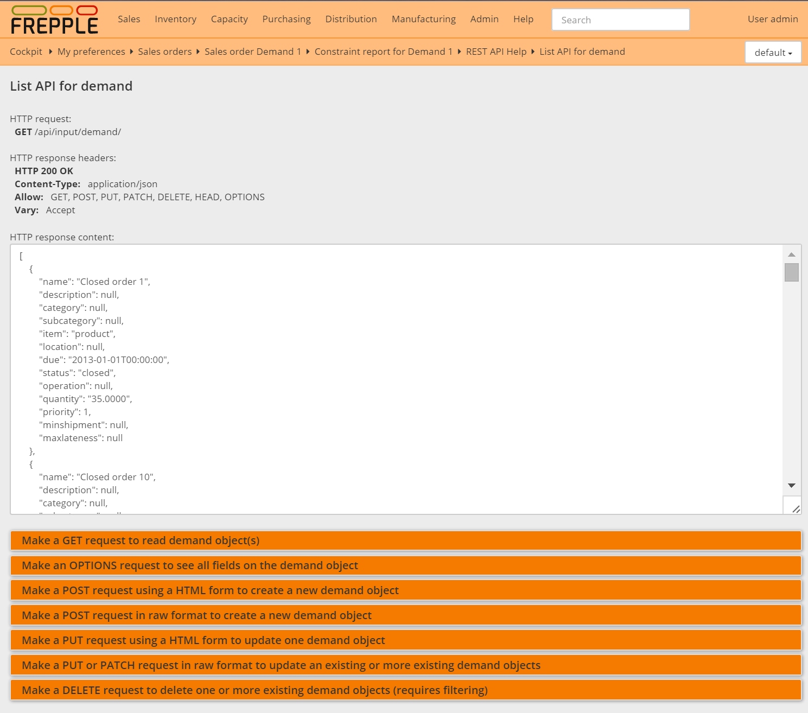
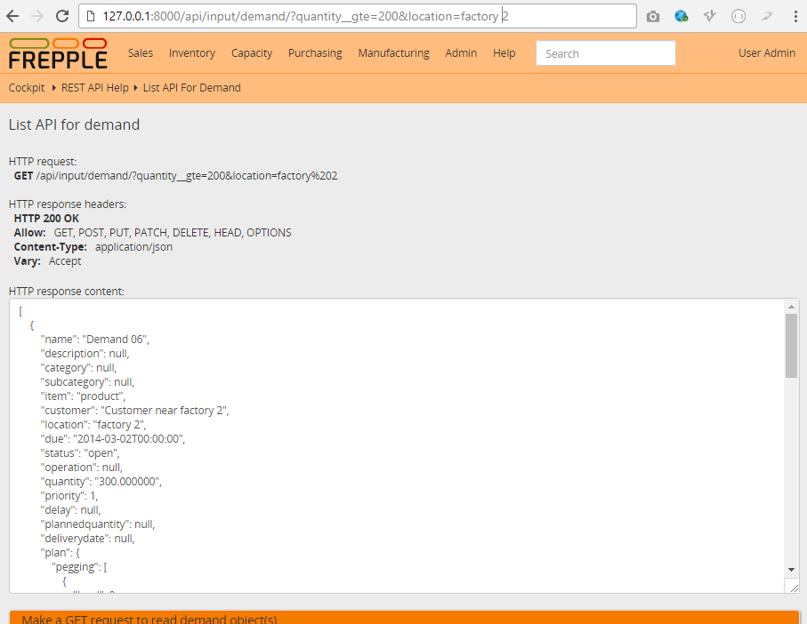

==========================
List API from your browser
==========================

The top part of this screen show the headers and content of the HTTP response of the web service.

The different sections below allow you to create new request for the GET, OPTIONS, POST, PUT,
PATCH and DELETE HTTP methods.
In the next image you can see a list of all demand objects and all the fields of each object.

It is also possible to filter GET and DELETE requests by introducing extra parameters in the URL.
The first extra parameter in the URL will start with a ``?`` and the following ones start with ``&``
Adding ``?quantity__gte=200&location=factory 2`` will output all demands with a quantity greater
or equal to 200 from location factory 2.

| For number, duration, and date fields the filters are: ``__gt``, ``__gte``, ``__lt``, ``__lte``,
 ``__exact``, ``__in``.
| For strings filters are: ``__exact``, ``__contains``, ``__in``. (including the local primary key field)
| For foreign key strings: ``__exact``, ``__in``.

In the DEMAND table the name field is the local primary key, and location field is a foreign key.
In this case you may use ``name__contains=06`` to get all the demands with 06 on the name, but you
cannot do a ``location__contains`` (as this field is a foreign key) but you may use
``location__in=factory 1,factory 2`` to list all demands from a list of specific locations.

Some models will allow bulk operations. For these models, requests in JSON format have been tested
for bulk POST using a LIST as argument, ie. ``[``*1 or more objects*``]``. The PUT request requires all fields in the JSON list of objects,
and the PATCH request requires the primary key field in each of the objects.

One other option that may be useful for frepple integration and connector troubleshooting to the format
of the response. Adding the ``format=json`` option will dump a JSON to the browser window.
