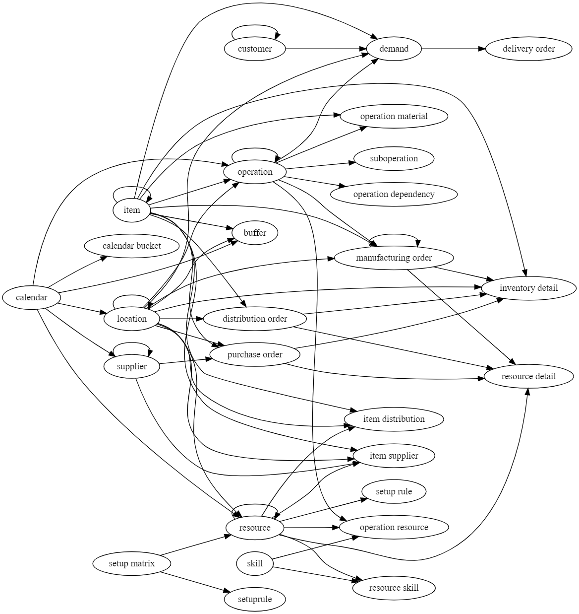

============
Domain model
============

The different entities in a model reference each other, and input data must
thus be entered in the correct order. This list show the correct order and
dependencies. Entities with a higher indentation depend on entities with
less indentation.

Start populating the entities at the top of the list and work your way down.

|  :doc:`customer` (references itself)
|  :doc:`setup-matrix`
|  :doc:`skill`
|  :doc:`calendar`
|    :doc:`Calendar bucket <calendar>` (references calendar)
|    :doc:`location` (references calendar and itself)
|    :doc:`supplier` (references calendar and itself)
|      :doc:`resource` (references setup matrix, calendar, location and itself)
|      :doc:`operation` (references location)
|        :doc:`resource-skill` (references skill and resource)
|        :doc:`load` (references resource, skill and operation)
|        :doc:`Sub operation <operation>` (references operation)
|        :doc:`operationplan` (references operation)
|          :doc:`item` (references operation and itself)
|            :doc:`item-supplier` (references supplier, item and location)
|            :doc:`item-distribution` (references location and item)
|            :doc:`demand` (references item, customer, operation, location and itself)
|            :doc:`buffer` (references item, operation, location, calendar and itself)
|              :doc:`flow` (references buffer and operation)

Note that it is pretty straightforward to extend the data model to match your
own domain model. During an implementation additional data types can be added
that map more accurately to your business and/or data sources.

The diagram below gives a more detailed overview of the models, their fields
and relations. You can also get is :download:`as a pdf <_images/domain-model.pdf>`.

.. image:: _images/domain-model.png
   :alt: Domain model
