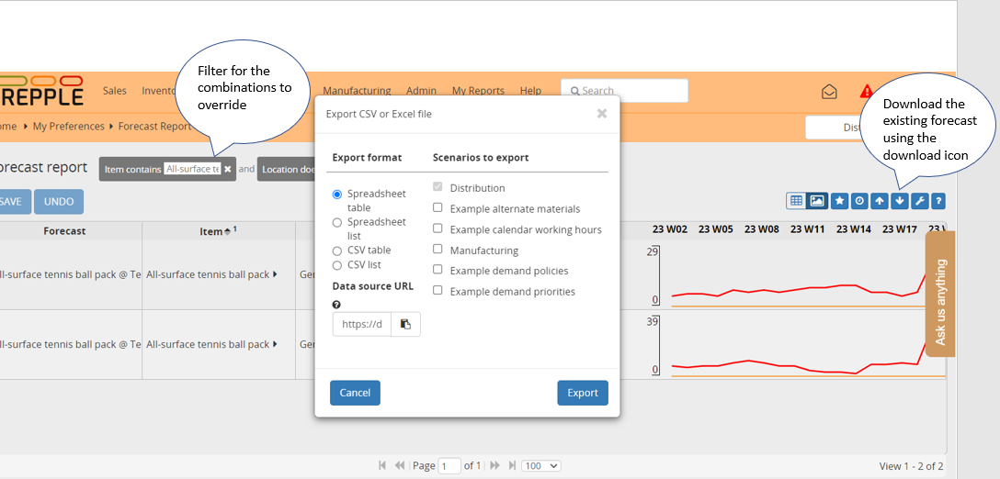

=============
Forecast plan
=============

This table contains all the forecast data. This is the table displayed in the
forecast report or the forecast editor screens.

This is also the table that needs to be updated when the user wants to apply forecast
overrides, order adjustments or update the value of a custom measure. Below the table description,
we provide some useful information on the format of the file to populate forecast overrides,
order adjustments or custom measure values.

================ ================= =====================================================================
Field            Type              Description
================ ================= =====================================================================
item             non-empty string  The item to which the forecast applies.
location         non-empty string  The location to which the forecast applies.
customer         non-empty string  The customer to which the forecast applies.
start date       dateTime          Starting date of the time bucket.
end date         dateTime          Ending date of the time bucket.
measure          double            | Measure here is any of the measures defined in
                                     in the measure table plus *forecastoverride*
                                     and *orderadjustment*
================ ================= =====================================================================

Manual forecast upload
----------------------

It's not uncommon that a planner uploads a manual forecast file
to override the statistical forecast calculated by frePPLe.

The format of the file that will be uploaded into the forecast report (or forecast editor) screen
needs to follow some conventions that we are explaining in this document.

The easiest way to proceed is to download the current forecast for the combinations that need to be updated.

As you can see on the above screenshot, 4 different formats are proposed:

- Spreadsheet table: The generated file is a pivot Excel file with the time buckets in columns

- Spreadsheet list: The generated file has a bucket column and the buckets are in a single column

- CSV table: same as spreadsheet table but in csv format

- CSV list: same as spreadsheet list but in csv format

Files in csv format are perfectly handled but we recommend Excel file to avoid any problem related to the
decimal/thousand separator or date format that could be different in the planner locale and in frePPLe.

The file that has just been downloaded can be uploaded back into the forecast report using the upload icon.

Note that:

- Only the forecast override and the order adjustment fields can be updated (or any editable measure the planner has created).
  All other fields are considered read-only and will not be updated.

- The buckets that are specified in the file can be different from the default forecasting bucket of the model
  (defined in the forecast.calendar parameter). FrePPLe has the logic to disaggregate/aggregate the numbers into
  the default forecasting bucket. For example, if the default forecasting bucket is the week, and the forecast override
  is defined in monthly bucket (100 for Jan 2025), then frepple will disaggregate that number into weekly buckets
  (25 for 25W01, 25 for 25W02, 25 for 25W03 and 25 for 25W04), proportionally to the existing statistical forecast.

- Similarly, it's not mandatory that the uploaded file only contains the lowest level of a given dimension
  (item,location,customer). It is possible to define a forecast override at any level of the hierarchy, frepple has the logic
  to disaggregate the quantity to the children (proportionnaly to the existing statistical forecast).

- Manual forecast files can be uploaded without existing `forecast <forecast.html>`__ records under two
  conditions. The forecast combination (item, location, customer) must be at leaf level (meaning that the item, location
  and customer are at the lowest level of the hierarchy) and the parameter forecast.populateForecastTable must be set to true.
  If these 2 conditions are met, the `forecast <forecast.html>`__ records will be created on the fly while
  uploading the file.

Some important notes on the format of the uploaded file:

- An Excel file downloaded from the forecast report screen will have the bucket names specified as strings.
  These bucket names are the ones defined in the `bucket dates <bucket-dates.html>`__ table.
  It is possible to replace in Excel the bucket names with a date format, frepple will pick the bucket
  that contains that date in the default forecasting bucket (defined in the forecast.calendar parameter).

  In other words, a format like this:

  .. image:: ./_images/forecast-upload-col-strings.png
     :alt: Forecast upload with strings

  is equivalent to a format with dates instead of bucket names:

  .. image:: ./_images/forecast-upload-col-dates.png
     :alt: Forecast upload with dates

- In the `forecast <forecast.html>`__ table, the name is unique
  for an item, location, customer combination. In the uploaded Excel file, it is therefore possible to only define
  the forecast column or to omit this column and define instead the 3 columns item, location and customer.
  Note that the uploaded forecast file can also contain the four columns: forecast, item, location and customer.

- For the list format only, it is possible to replace the bucket column with 2 columns *start date* and *end date* that
  would contain dates:

  .. image:: ./_images/forecast-upload-sd-ed.png
     :alt: Forecast upload with start/end dates

  The result is a disaggregated forecast across all the buckets defined in the start date, end date range defined,
  proportionally to the existing statistical forecast (row forecast baseline in the above screenshot).

  .. image:: ./_images/forecast-upload-sd-ed-result.png
     :alt: Forecast upload with start/end dates disaggregated

- For the list format only, and exactly as above, it is possible to omit the bucket column on only specify a start date
  column.

  .. image:: ./_images/forecast-upload-sd.png
     :alt: Forecast upload with start dates

  In that case, the forecast override quantity will be applied to the bucket where the start date falls, using
  the default forecasting bucket:

  .. image:: ./_images/forecast-upload-sd-result.png
     :alt: Forecast upload with start dates