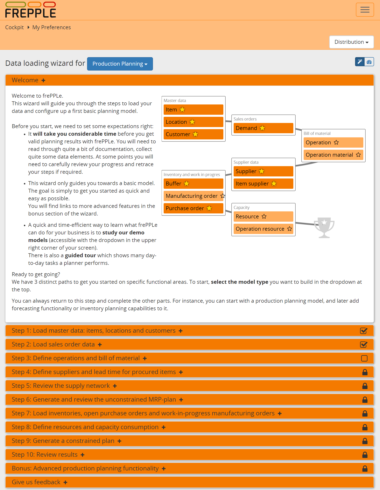

========================
Wizard to load your data
========================

**This section accompanies the data loading wizard available in the user interface.
That wizard guides you through a number of logical steps and contains links to this section.**

This section guides users during the creation of their first frePPLe model.

  .. Important::

     | The wizard aims at helping you to bring up a basic model as quick and easy
       as possible.
     | It does NOT cover all possible features and functionality of frePPLe.

.. toctree::
   :maxdepth: 2

   concepts
   master-data/index
   purchasing/index
   distribution/index
   inventory-planning/index
   manufacturing-bom/index
   manufacturing-capacity/index
   generate-plan
   common-modeling-mistakes
