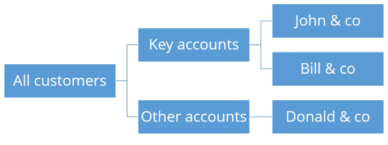

=========
Customers
=========

The Customers table contains all the customers passing orders to your business.

.. rubric:: Key Fields

============ ================= ===========================================================
Field        Type              Description
============ ================= ===========================================================
name         non-empty string  Unique name of the customer.
description  string            Free format description.
owner        location name     Hierachical parent of the location.
============ ================= ===========================================================

.. rubric:: Customer hierarchy

.. Hint::

   Setting up a good customer hierarchy is important if you are interested in the demand forecasting functionality. 
   Otherwise, you can skip modeling a customer hierarchy.

Using the owner field the customers can be organized in a hierarhical tree structure. This allows,
among other, reviewing the forecast at different levels in the 
:doc:`../../user-interface/plan-analysis/forecast-editor`.

Here is an example to model a tree structure with different customer priorities:

=============== ===============
Name            Owner
=============== ===============
All customers  
Key accounts    All customers
John & co       Key accounts
Bill & co       Key accounts
Other accounts  All customers
Donald & co     Other accounts
=============== ===============

.. rubric:: Advanced topics

* Complete table description: :doc:`../../model-reference/customers`
