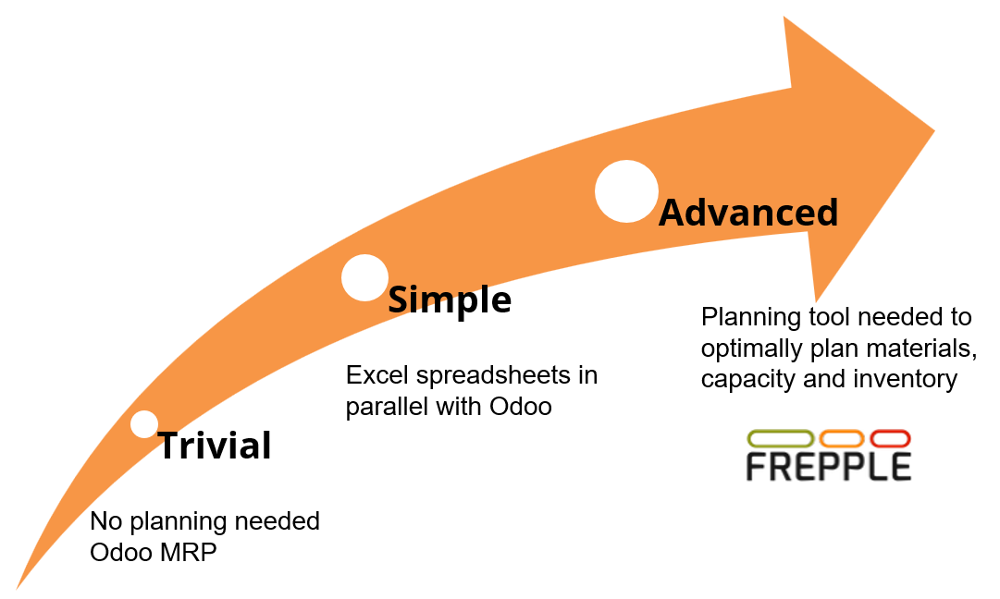

=================================
Overview frePPLe-Odoo integration
=================================

FrePPLe is an advanced planning and scheduling (APS) software.

When the planning problem is simple, Odoo's built-in MRP is sufficient to plan
the purchase and manufacturing orders.

When the planning problem becomes more complex, you'll quickly notice that planners
use Excel spreadsheets in parallel with Odoo. They don't sufficiently recognize their
decision-making process reflected in the transactional system of Odoo (or any ERP system
for that matter).

And when the planning problem grows even more complex, planners need to use a dedicated
planning and scheduling software like frePPLe. It's a powerful tool for optimizing
complex production, inventory planning, purchasing operations in your supply chain.

It is designed to help businesses improve their operational efficiency, reduce costs, and
enhance customer satisfaction.

You might want to take one step back and understand
`what Odoo cannot do for planners <https://frepple.com/blog/five_things_Odoo_mrp_doesnt_do/>`_
and why advanced planning is required for complex environments.

FrePPLe has a long history of working with Odoo. Our Odoo integration provides:

- | All master data and transactions are managed by Odoo.
  | The frepple connector brings synchronizes all planning data to frePPLe to
    assure your plan is always based on the latest information.

- | Publish the plan easily back to Odoo.
  | FrePPLe proposes new purchase orders and new manufacturing order, and reschedules
    work orders.
  | After review by the planner, this plan can easily be published back to Odoo.

- | User interface integration.
  | A single sign-on allows users to access frePPLe screens from the Odoo interface, without
    logging in a second application.

- | Open source software.
  | The connector is open source, allowing you to customize and extend its functionality to
    meet your specific Odoo customizations and planning requirements.

The connector can be downloaded from the `Odoo apps store <https://apps.Odoo.com/apps/modules/19.0/frepple>`_.
The connector is available for the last 3 versions of Odoo (currently the 17, 18 and 19).
