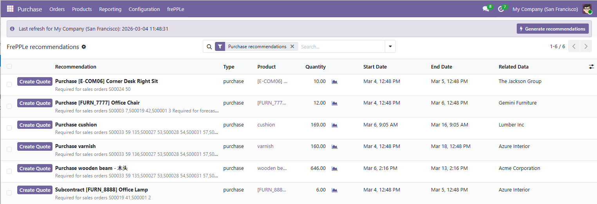

=======================
Recommendations in Odoo
=======================

FrePPLe analyzes the supply and demand situation in your Odoo data. It generates a set of
recommendations to start working on.

These recommendations are actionable activities that can be accepted by the Odoo users, which
will trigger the creation of a draft order in Odoo.

* | Purchase orders to be placed within the new 2 weeks.
  | When accepting the recommendation, a RFQ is created in Odoo.

* | Manufacturing orders to be created within the next week.
  | When accepting the recommendation, a draft Manufacturing order is created in Odoo.

* | Manufacturing orders to be rescheduled to a new date.
  | When accepting the recommendation, the scheduled start of the manufacturing order and its
    work orders are updated to the start date computed by frePPLe.

* | Sales order delay recommendations inform the Odoo users about sales orders where
    the promised delivery date is infeasible.
  | This is an information-only recommendation.

