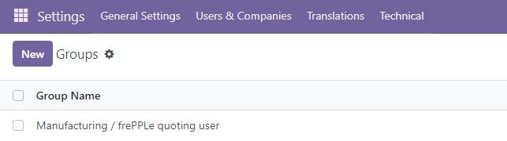

Addition of menus in Odoo
-------------------------

After installation, users find the following additional features in odoo:

* | The menu bar in the sales, purchase, inventory and manufacturing apps
    get 1) a link to open the frepple user interface and 2) a link
    to the recommendation list.

  .. image:: _images/odoo-menu-bar.png
   :alt: Frepple

Addition of extra views and fields in Odoo
------------------------------------------

* | A new table has been added to Odoo with **frepple recommendations** on your plan.

  | The frepple recommendations represent a list of actionable activities relevant for the
    short term plan in Odoo.

  * | Purchase orders to be placed within the new 2 weeks.
    | When accepting the recommendation, a RFQ is created in Odoo.

  * | Manufacturing orders to be created within the next week.
    | When accepting the recommendation, a draft Manufacturing order is created in Odoo.

  * | Manufacturing orders to be rescheduled to a new date.
    | When accepting the recommendation, the scheduled start of the manufacturing order and its
      work orders are updated to the start date computed by frePPLe.

  * | Sales order delay recommendations inform the Odoo users about sales orders where
      the promised delivery date is infeasible.
    | This is an information-only recommendation.

     .. image:: _images/recommendations.png
      :alt: Recommendations view in odoo

Quoting capabilities
--------------------

Starting from Odoo 17, the connectors also allow the planner to use the frePPLe quoting
module from Odoo.

To activate this functionality for an Odoo user, this user needs to be part of the *frePPLe quoting user*
group.

| Note that the quoting capabilities are only available in the Enterprise Edition of frePPLe.
  When using the frePPLe Community Edition these links will result in a
  page-not-found error message.

* | The quoting capabilities brought by the connectors offer 2 distinct possibilities:

  1. Addtion of a **quote** button at the bottom of the *other info* tab of the quotations in the sales app.

      .. image:: _images/quotations-quote-button.png
        :alt: Extra quote button in the quotations

     If the *Delivery Date* field is empty, clicking on the *Quote* button will fill this field with the
     first possible date to deliver this quotation.

     If the *Delivery Date* field contains a date, clicking on the *Quote* button will check if it is possible to
     deliver the quotation at the delivery date. If it is possible, the *Delivery Date* remains unchanged.
     If it is not possible, the delivery date is updated with the new date (that can only be later than the old one).

     Note that, if the quotation contains multiple lines, the proposed delivery date will be the latest of all
     the lines.

     In the message section, planning information is added for each quotation line:

     .. image:: _images/quotation-message.png
        :alt: Messages contain planning details

  2. Addtion of a *FrePPLe Quotes* view accesible with a menu.

     .. image:: _images/frepple-quotes-menuitem.png
        :alt: An additional menu for the frePPLe quotes

     The *frePPLe Quotes* screen allows the planner to get in a matter of seconds a promised date for
     a product.

     The planner needs to fill the quote information (product, quantity, warehouse...) and hit the *quote*
     button.

     .. image:: _images/quote-promised-date.png
        :alt: A promised date is returned

     From the main screen of the *Frepple Quotes*, a *bulk quote* action is also available to allow the planner
     to compute a promised date for multiple lines at a time.
