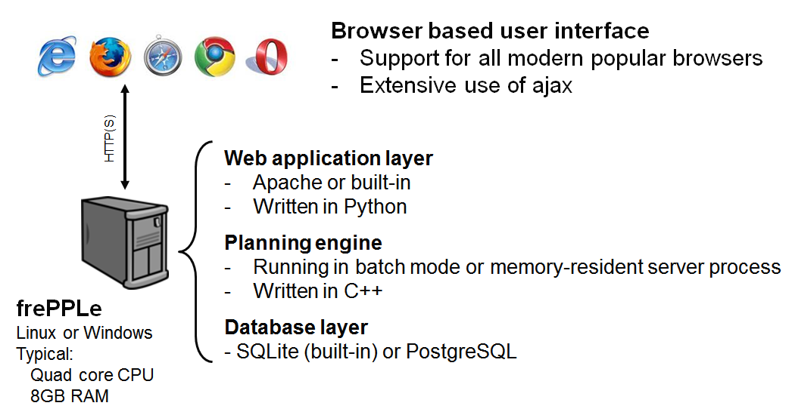

============
Architecture
============

FrePPLe has a 3-tier architecture, typical for most web applications.

* | **Browser based front-end**:
  | The user interface is completely web browser based, using state of the
    art web techniologies such as HTML5 and ajax.
  | FrePPLe supports most modern browsers: Google Chrome, Firefox, Safari,
    Internet Explorer(>=10) and Opera.

* | **Web server**:
  | The web server retrieves data from the database and serves the content
    as HTML pages to the user.
  | FrePPLe supports the Apache web server, and also has a built-in
    Python-based web server.
  | Long running tasks (such as the planning algorithm, database backup,
    scenario copying, ...) and the REST-api extension module don’t run in the
    web server process. Instead, the web server will spawn a separate worker
    process to execute these.

* | **Database backend**:
  | The planning data are stored in a relational database. FrePPLe supports
    PostgreSQL and SQLite as databases.
  | The database schema is simple and stable, which makes is easy to integrate
    frePPLe data with external data source.

Given the choice of database and web server, different options are available
to deploy frePPLe:

* | **Windows all-in-one installation**:
  | The windows installer comes bundled with the SQLite database and a
    Python-based web server. No extra components need to be installed on your
    machine – just click through the installer, and you’re up and running in 2
    minutes.
  | This setup will work fine for small models in a single-user environment. It
    is also the recommended option to get started and try out frePPLe.

* | **Enterprise deployment**:
  | In a production environment an Apache web server and a PostgreSQL database
    are required.
  | This setup scales very well to large models and a large number of
    concurrent users. It is the recommended option for day-to-day robust
    production use of frePPLe.

* | **Backend planning engine without user interface**:
  | It is also possible to use the planning engine as an independent component.
  | This is useful is you want to embed the planning engine in another system.
    Users use the other system as the front-end, and frePPLe's algorithms are
    are used in the back-end to generate the plans.

