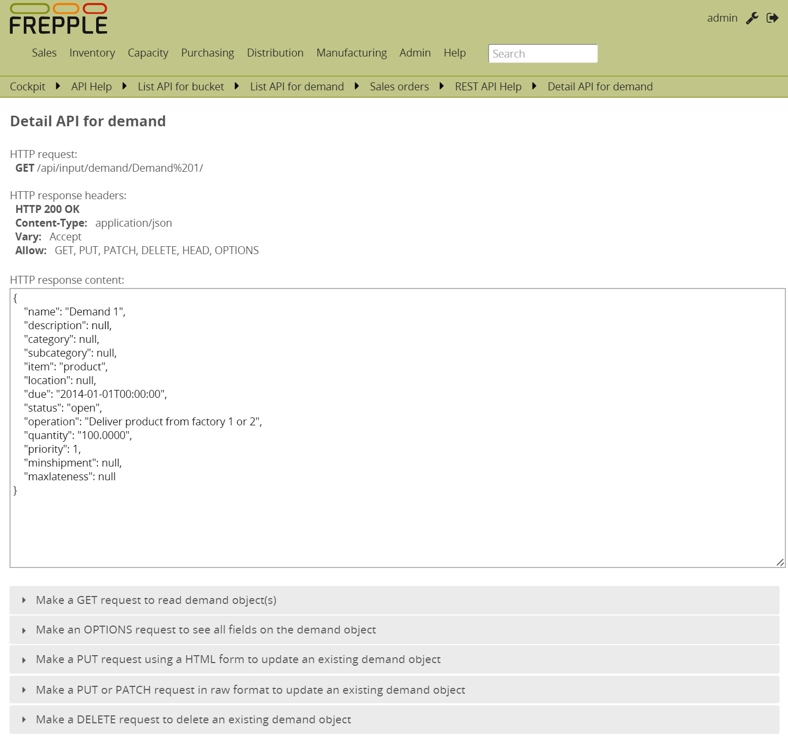

============================
Detail API from your browser
============================

The top part of this screen show the headers and content of the HTTP response of the web service.

The different sections below allow you to create new request for the GET, OPTIONS, PUT,
PATCH and DELETE HTTP methods on the selected object.

