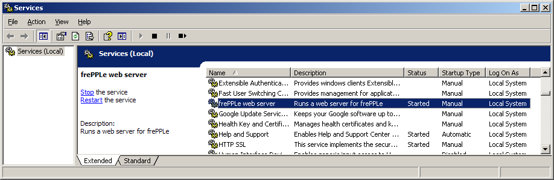

==================
freppleservice.exe
==================

This executable is available only on Windows. It allows controlling a Windows
service that runs the frePPLe web server for the user interface.

The Windows event log provides information on starts and stops events of the
service.

Usage:

* | **freppleservice [options] install**
  | Register the new service.
  | After this step, you’ll be able to see the service in the Service Manager.

* | **freppleservice [options] update**
  | Update the configuration of the service.

* | **freppleservice [options] remove**
  | Remove the service.
  | After it’s stopped, the service will be removed from the list shown in
    Service Manager.

* | **freppleservice [options] start**
  | Start the service.
  | The action is the same as starting the service from the Service Manager.

* | **freppleservice [options] stop**
  | Stop the service.
  | The action is the same as stopping the service from the Service Manager.

* | **freppleservice [options] restart**
  | Restart the service.
  | The action is the same as restarting the service from the Service Manager.

Options for ‘install’ and ‘update’ commands only:

* | **–username domain\username**
  | The Username the service is to run under.

* | **–password password**
  | The password for the username.

* | **–startup [manual|auto|disabled]**
  | How the service starts, default = manual

Options for ‘start’ and ‘stop’ commands only:

* | **–wait seconds**
  | Wait for the service to actually start or stop.
  | If you specify –wait with the ‘stop’ option, the service and all dependent
    services will be stopped, each waiting the specified period.
