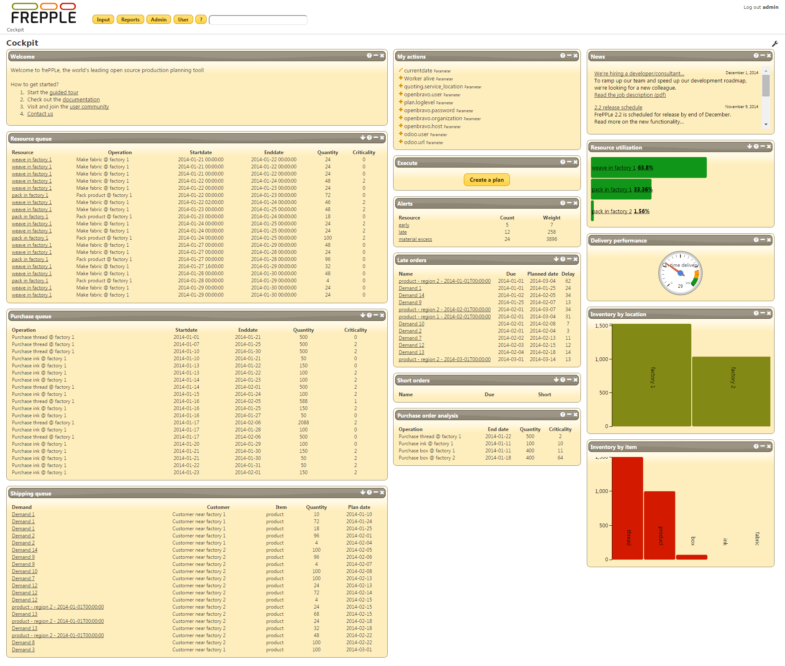

=======
Cockpit
=======

The cockpit is the home page of the application. Structured as a dashboard it
provides a number of widgets that a planner uses in his daily planning
activities. It is an efficient starting point for the common activities.

The cockpit is configurable to meet the requirements and taste of your
implementation. Customized widgets are also easy develop. In the
**Community Edition** all users will see the same dashboard. In the
**Enterprise Edition** every user gets his own dashboard, which he can
customize interactively.

.. rubric:: Available widgets

The following widgets are currently available:

* | **Resource queue**
  | This is the list of operations that are about to be started on each
    resource.

* | **Purchase queue**
  | Displays a list of new purchase orders that should be placed on your
    suppliers.

* | **Shipping queue**
  | Displays a list of customer orders that are about to be shipped.

* | **Welcome widget**
  | A welcome text to give first-time users some guidance to get started
    with the application.

* | **News**
  | This widget picks up the latest news topics from frepple.com.

* | **Recent actions**
  | Shows your most recent editing actions.

* | **Generate plan**
  | Regenerates a constrained plan.

* | **Alerts**
  | Shows a summary of the exceptions and problem areas.

* | **Late orders**
  | Shows the most urgent orders that are planned late.

* | **Short orders**
  | Shows the most urgent orders that are unplanned or incompletely planned.

* | **Purchase order analysis**
  | Shows the urgency of the existing (locked) purchase orders.

* | **Resource utilization**
  | Displays the resources with the highest utilization.

* | **Delivery performance**
  | This widget shows the percentage of order lines that are planned to be
    shipped on time.

* | **Inventory by location**
  | This widget shows the locations carrying the most inventory.

* | **Inventory by item**
  | This widget shows the items which take up the most inventory value.

.. rubric:: Configuring the cockpit

| The configuration is different in the Community Edition and the Enterprise
  Edition.
| In the Community Edition the same dashboard is configured for all users.
| In the Enterprise Edition every user can easily customize the dashboard
  with the widgets that are most relevant for his/her daily work.

* **Default dashboard**

  The default dashboard is configured in the file djangosettings.py.
  The setting DEFAULT_DASHBOARD specifies a) the number and width of each
  column, b) the widgets displayed in each column, and c) configuration
  values for the widget.

  ::

    DEFAULT_DASHBOARD = [
      {'width':'50%', 'widgets':[
        ("welcome",{}),
        ("resource_queue",{"limit":20}),
        ("purchase_queue",{"limit":20}),
        ("shipping_queue",{"limit":20}),
      ]},
      {'width':'25%', 'widgets':[
        ("recent_actions",{"limit":10}),
        ("execute",{}),
        ("alerts",{}),
        ("late_orders",{"limit":20}),
        ("short_orders",{"limit":20}),
      ]},
      {'width':'25%', 'widgets':[
        ("news",{}),
        ('resource_utilization',{"limit":5}),
        ("delivery_performance",{"green": 90, "yellow": 80}),
        ("inventory_by_location",{"limit":5}),
       ("inventory_by_item",{"limit":10}),
      ]},
      ]

* **Customized dashboards**

  In the Enterprise Edition users can drag and drop the widgets to a
  different location. New widgets can be added by clicking on the wrench
  icon in the upper right corner of the screen. The new settings are
  automatically saved to the server.
