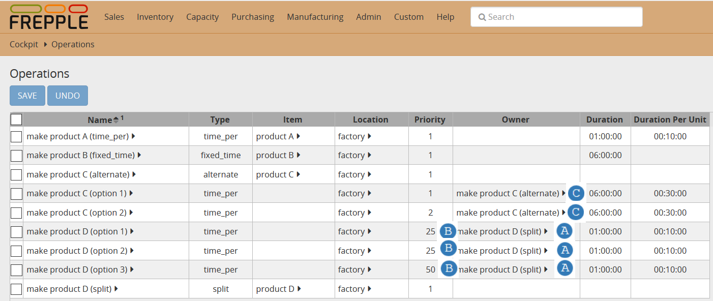
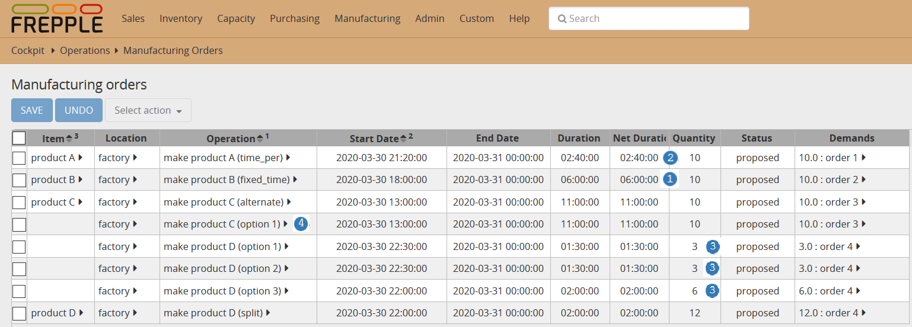

==============
Operation Type
==============

When creating operations in frePPLe, different operation types are available and should be 
selected wisely depending on the expected behavior:

* **Fixed_time**

  | The duration of the operation is constant, regardless of the quantity being planned.

  | A typical example is a transport operation: transporting 1 piece with a truck takes just
    as long as transporting 100 pieces. Only the *Duration* field needs to be populated to
    define the duration of the fixed time operation.

* **Time_per**

  | The duration of the operation increases linearly with the planned quantity. The total
    duration takes the form of 'A + B * quantity', where A and B are constants. The A value
    corresponds to the *Duration* field 
    while the B value corresponds to the *Duration Per Unit* field.

  | A typical example is a production operation: there is a fixed overhead of machine
    setup at the start, and the actual production is linear with the quantity to produce.

* **Split**

  | This operation type plans the demand proportionally over a number of operations, based
    on pre-defined percentages. The operations for which the split should occur should define
    in the *Owner* column the split operation :samp:`À`. The percentage should be put in the 
    *Priority* column :samp:`B`. There is no need that the percentages sum up to 100, frePPLe
    will compute a percentage in the background based on the weight of each operation.

* **Routing**

  | This operation type represent the sequence of operations that need to be run in sequence.
    There is a specific example for the `routing <operation-routing.html>`_, please refer to it for more details.

* **Alternate**

  | This operation type represent the choice between alternate operations to achieve the
    same result. Another `example <operation-alternate.html>`_ is dedicated to this.
  | In the majority of models you don't have to explicitly use alternate operations 
    in your model. FrePPLe will automatically create them as soon as there are multiple
    replenishment methods.
    
  | The alternate operation should be set as *Owner* :samp:`C` for the different alternate 
    operations. The priority can be used to have the solver pick an operation over another one.

Note that the actual duration for the operation respects the working hours and holidays periods.
These are defined in the available calendar of the operation and/or its location.
The time between the start and end date of a manufacturing order or distribution order
will then be extended with any unavailable time.

`Check this feature on a live example <https://demo.frepple.com/operation-type/data/input/operation/>`_

:download:`Download an Excel spreadsheet with the data for this example<operation-type.xlsx>`

   
* **Fixed_time**

  | Fixed time operations take the same amount of time regardless of the produced quantity.
    We can see in above screenshot that it took 6 hours :samp:`1` which is the *Duration* of the 
    operation to produce 10 units of product B.
  
* **Time_per**

  | To produce 10 units of product A, the operation duration is equal to the *Duration* + 10 * *Duration Per Unit*.
    This gives 1 hour + 10 * 10 minutes = 2 hours and 40 minutes :samp:`2`.
  
* **Split**

  | Order 4 for product D has a quantity of 12. The split defined in the operation table is 25% for *make product D (option 1),
    25% for *make product D (option 2) and 50% *make product D (option 3)*.
    We can see in the manufacturing orders that the split is respected as the first 2 operations plan a quantity of 3 when the
    last operation plans a quantity of 6 :samp:`3`.
  
* **Alternate**

  | There are two alternate operations to produce *product C*. Operation *make product C (option 1)* has a priority of 1 and has
    therefore been picked by the solver as this operation could deliver on time the demand :samp:`4`.