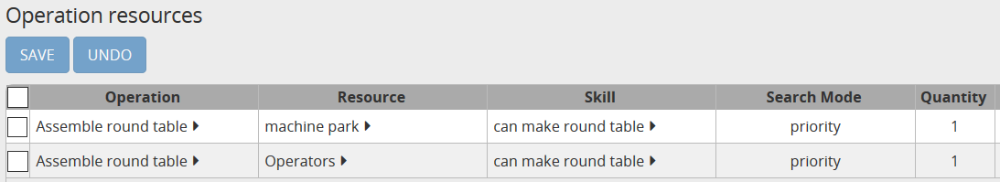
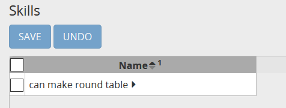

==================
Resource alternate
==================

In many industries, the same operation can be performed by different resources, whether these
resources are machines, tools or operators.
However we might want to restrict a given operation to some resources only, this is achieved in
frePPLe by using the concept of skills.

Examples are:

* A new machine can perform the same tasks as an old machine (and often faster).

* Only operators with a specific skill can complete a given operation.

The standard operation duration is modelled in frePPLe at the operation level (with the 
"fixed duration" and "duration per" fields). If the duration of an operation depends on the picked 
resource then this has to be modelled either using the concept of efficiency 
(see `resource efficiency example <resource-efficiency.html>`_)
or with alternate operations 
(see `alternate operations example <../operation/operation-alternate.html>`_).

.. rubric:: Example

In the following example, we are modelling an operation that assembles round tables.
To assemble a round table we need both an operator and a machine.

`Check this feature on a live example <https://demo.frepple.com/resource-alternate/data/input/resource/>`_

* machine A, machine B and machine C are the 3 machines available in the factory. Only machine A and machine B
  can assemble a round table. Machine A is prefered over machine B as it is faster (efficiency set at 120%).

* "machine park" is the parent resource of all machine resources and will be used in 
  `Operation Resources table <../../../user-guide/model-reference/operation-resources.php>`_.
  
* "Antonio", "Carl" and "Philippe" are three operators. Only "Antonio" and "Carl" can make a round table. 

* "Operators" is the parent resource of the three operators.

.. image:: images/resources.png
   :alt: Resources.

To model alternate resources in frePPLe, we need to declare the parent resource
in the `Operation Resources table <../../../user-guide/model-reference/operation-resources.php>`_.
The solver understands it has to pick a resource in the pool of resources that satisfies the skill criteria.

The *search mode* column lets the solver know how the resource has to be picked. Possible options for the search mode are:

  .. rubric:: **Priority**
  
  When search mode is set to *priority*, frePPLe will pick the resources with highest priority (defined in resource skill table)
  as long as the demand is planned on time.
  
  .. rubric:: **Minimum cost search mode**
  
  When search mode is set to *minimum cost*, frePPLe will pick the resource that minimizes the cost of production.
  Each upstream cost, whether it is at operation, resource, item supplier or item distribution level is included in the total calulated cost and multiplied by
  the number of parts produced, purchased, shipped.
  
  .. rubric:: **Minimum penalty**
  
  When search mode is set to *minimum penalty*, frePPLe will pick the resource that minimizes the penalty.
  A penalty is paid by an resource each time it produces some material earlier than the requested date. 
  
  If we set the search mode to *minimum penalty*, then frePPLe
  will pick the first resource to produce the first demand (both have a penalty of 0 as they can produce on time). FrePPLe will then pick the second resource
  to produce the second demand (as the first resource will pay a penalty because it has been picked for the first demand and can only produce earlier). Then,
  for the third demand, both resources will have the same penalty and frePPle will pick again the first one.
  
  .. rubric:: **Minimum cost plus penalty**
  
  Obviously, this option is a combination of the cost and the penalty. FrePPLe will compute both the cost and the penalty for a resource and will pick the one
  that minimizes the sum.

For the machine park, we have set the search 
mode to *priority* as we want frePPLe to choose machine A over machine B. For the operators, we are also using *priority* search mode
with a priority 1 for Antonio and a priority 2 for Carl.

The skills have to be defined in the `Skills <../../../user-guide/model-reference/skills.php>`_ table :

We associate the skills to a given resource in the `Resource Skills <../../../user-guide/model-reference/resource-skills.php>`_ table:

.. image:: images/resourceskills.png
   :alt: resource skills.

Note that:

* Skills are not mandatory, the skill column in the operation resource table can be left empty. The solver will then assume all resources in the pool are eligible. 

* A resource can have more than one skill.

* We could have used a different skill for the machines and the operators in the example.

In the Resource Skills table, we have set a priority of 1 to *machine A* and *Antonio* as these are the preferred options. Other resources get a priority of 2.

As long as the demand is planned on time (or early), the solver will pick the combination *machine A* / *Antonio* to plan the demand. When a demand is to be planned late, then the solver will jump to the second combination *machine B* / *Carl*.

