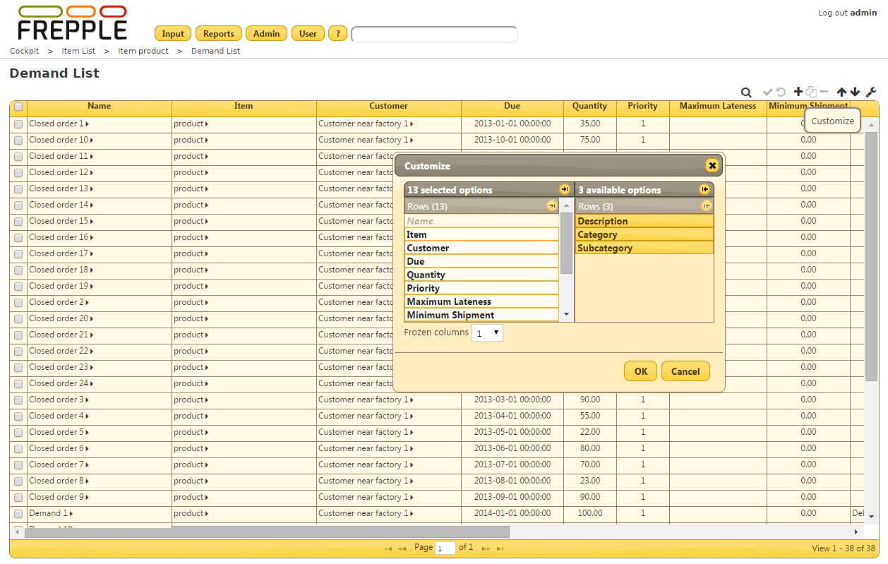

====================
Customizing a report
====================

.. Note::
   This feature is only available in the Enterprise Edition.

Each user can update the configuration of the reports to suite his needs and taste.

Click the customize icon in the tool bar to bring up a popup window where the user
can update:

* | **Fields to be shown**:
  | Click on a field to toggle its visibility.
  | Note that the key field of a table cannot be hidden.

* | **Order of the fields**:
  | Drag and drop a visible field to the desired position.

* | **Number of frozen columns**:
  | Select the number of columns that stay in place when you scroll to the right.

* | **Column width**:
  | Changing the column width is not done from the popup window, but directly
    in the report itself.
  | Hover the mouse over the boundary between 2 columns, holds the mouse down and
    drag to the correct width.

* | **Filters, sorting and paging**:
  | :doc:`Filtering criteria <filtering-data>`, :doc:`sorting <sorting-data>`
    and page number are preserved. When you re-open the report later on it will
    opens exactly as when you left it.

The settings are stored on the server when you hit the OK button.

