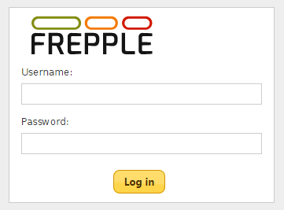

==========================
Logging in and logging out
==========================

You can log in using your user name or your email address.

A default user is created after installation: user name **admin** and
password **admin**.

.. Danger::
  For security reasons, it is highly recommended to change the password
  of this user.

Links to log out are provided in the user menu and in the upper right
corner, next to your user name.

The user accounts and their permissions are maintained by the administrator.
