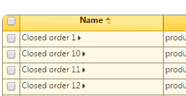

============
Sorting data
============

Clicking on a column header will sort the sort the data in ascending order.
Another click will sort in descending order.

A triangular icon indicates the sorting direction.

In the **Enterprise Edition** the sorting is automatically stored on the
server: see :doc:`customizing-a-report`. When you reopen the report later on,
the report will open with the sorting as when you left it.

