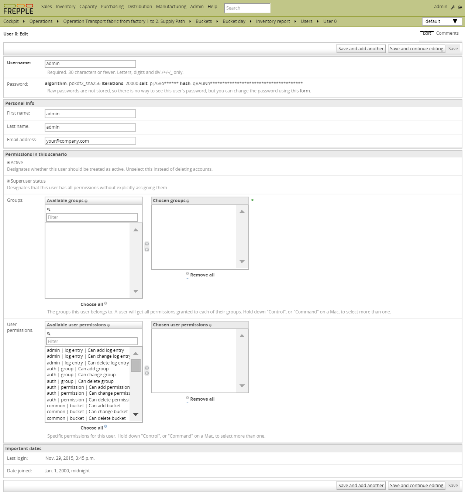
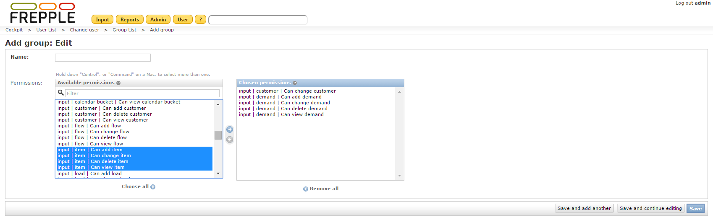

==========================
User permissions and roles
==========================

An administrator can create login accounts, set their password and permissions.

Groups are a generic way of categorizing users and apply permissions to those users.
A user in a group inherits all the permissions granted to that group.

A user can belong to any number of groups.

.. important::

   When defining users, make sure to enable the staff-status field.

