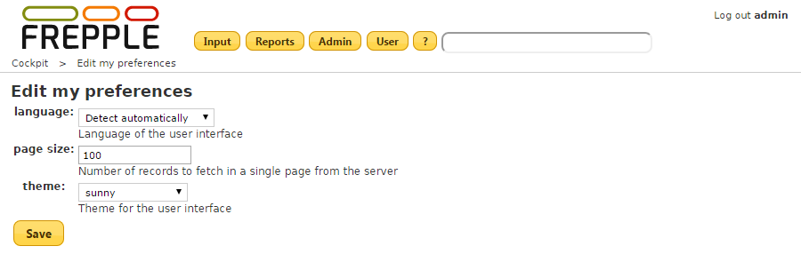

================
User preferences
================

For each user frePPle stores a number of personal settings and preferences.

* | **Language**:
  | Specifies the language of the user interface.
  | By default frePPLe will detect the preferred language of your web browser
    and use that.
  | You can override this and force a particular language.

* | **Page size**:
  | Number of records to fetch in a single page from the server.
  | The default value is 100. Values lower than 25 are not accepted.
  | Selecting a high value can slow down the display of the reports.

* | **Theme**:
  | Theme for the user interface.
  | The available themes can be previewed on the `Jquery UI ThemeRoller website <http://jqueryui.com/themeroller/>`_.
  | Customized themes can be designed on that page as well.

