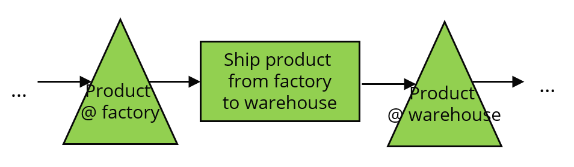
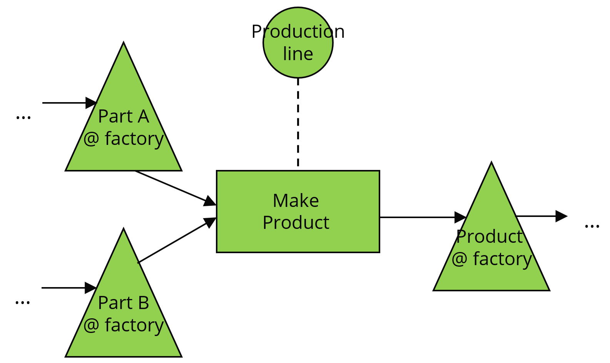

=================
Modeling concepts
=================

Before you start your journey to load your data in frePPLe, we need to 
explain you a few modeling basics.

Concepts as items, locations, customers, demands... don’t need a much of
an introduction. But, some other concepts need some introduction before you
get your hands dirty.

**Buffer**

A buffer is a item+location combination. It is a inventory point for an item
at a specific location.

There are three different ways to replenishing a buffer:

1. The item can be purchased from a supplier
2. The item can be transfered from another location
3. The item can be manufactured

It is possible to define multiple replenishment methods for a buffer: for 
instance "buy from supplier X or supplier Y", "make the item or buy the item". 
In such a case the planning algorithm will automatically choose the appropriate 
method.

**Buy: Replenishing with a purchase order**

The :doc:`purchasing/index` section of this wizard will guide you through this.

By populating the supplier and itemsupplier tables we define that a buffer
can be replenished with a purchase order to a specific vendor.

.. image:: _images/modeling-purchase.png
   :alt: Modeling - Purchase operation
   :scale: 33%
   :align: center
  
**Transfer: Replenishing with a distribution order**

The :doc:`distribution/index` section of this wizard will guide you through this.

By populating the itemdistribution table we define that a buffer
can be replenished with a distribution order (aka transfer order or stock transfer
order) from another location.

**Make: Replenishing with a manufacturing order**
 
The :doc:`manufacturing-bom/index` and :doc:`manufacturing-capacity/index`
sections of this wizard will guide through this.

A number of tables are required to define the operation, its
produced materials, its consumed materials and its capacity usage.
The diagram below shows the buffers as a triangle, operations as a rectangle
and resources as a circle. 

**Putting it all together**

Combining all of the above building blocks we can construct a network
representing the complete supply chain from end to end.

The picture below shows a simple network with 3 levels.

.. important::

   Drawing this type of schematic network of your environment is extremely 
   useful before you start entering data in frePPLe. It will help you in
   getting the data ready for the next steps of this wizard.

.. image:: _images/modeling-network.png
   :alt: Modeling - putting it together
   :width: 100%
   :align: center

Once you will have populate your data in frePPLe, you can verify the 
correctness of your model by visualizing the network you have defined.
This is done with the :doc:`../user-interface/plan-analysis/supply-path-where-used`
report.

You can try to look at the supply path of some sales orders
in any of the demo models:

* Open the sales order list from the menu "sales / sales orders"
* Select any sales order from the list by clicking on the triangle next
  to its name.
* Select "supply path" from the available tabs.
 