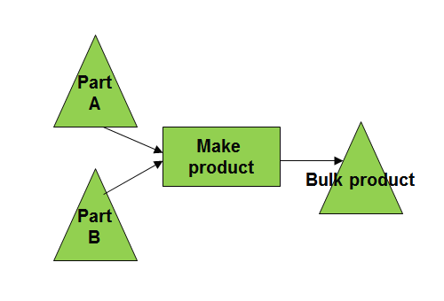
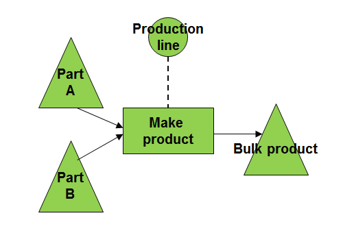

==================
Modelling concepts
==================

| Concepts as items, locations, customers, demands, ...don’t need a much of
  an explanation.
| The modelling concepts of operations, material and capacity consumption
  however need some introduction.

**Operation**

The key modelling element is an operation, which defines an activity
at a given location producing an item.

There are different operation types:

* fixed time: the duration is identical regardless of the planned quantity.
  Eg, a transport operation

* time-per: the duration increases linearly with the planned quantity.
  Eg, a manufacturing operation

* routing: this operation type represent a sequence of sub-operations.

* alternate: an alternate operation models the choice among multiple choices.

| Example:
  Operation 'Make product X' takes 10 minutes per unit.

.. image:: _images/modelling-1.png
   :alt: Modeling - Operation

**Buffer**

Items are stocked in buffers. A buffer, often called SKU -stock keeping unit-,
is a (physical or logical) inventory point.

There are different buffer types:

* default: a buffer that is replenished with a producing operation

* infinite supply: a buffer without replenishing operation

| Example:
| Buffer 'Part A' models inventory of the item 'part A' in location 'my factory'.
| Buffer 'Part B' models inventory of the item 'part B' in location 'my factory'.
| Buffer 'Bulk product' models inventory of the item 'bulk product' in location 'my factory'.

.. image:: _images/modelling-2.png
   :alt: Modeling - Buffer

**Operation materials**

Operations consume and produce material. Operation materials define an
association between an item (either produced or consumed) and an operation.

They therefore represent the Bills of Material (aka BOM) in your model.

When the item is consumed, the quantity should be negative.
When the item is produced, the quantity should be positive.

There are 2 types of operation materials:

* start: The consumption/production occurs at the start of the operation. These are normally consuming
  material and have a negative quantity.

* end: The consumption/production occurs at the end of the operation. These are normally producing
  material and have a postive quantity.

| Example:
| Operation 'Make product X' has 3 operation materials.
| A first operation material to consume 1 units of item A at the start of the
  operation.
| A second operation material to consume 2 units of item B at the start of the
  operation.
| And finally a third operation material to model the production of 1 unit of X
  when the operation finishes.

**Operation resources**

Operations also require capacity. Capacity is
available in resources and operation resources define an association between the operation
and a resource.

| Example:
| The resource 'production line' is required to perform the operation.

**Operationplan**

An operation only statically defines the activity, and doesn’t specify any
planned dates or quantities. Concrete activities are then instantiated in
operationplans.

| Example:
| To satisfy a customer demand we plan to run 'Assemble product X' for 12
  units from tomorrow 8am till 10am.
| Another instance of 'Make product X' is planned the next day from 3pm to 4pm
  for 6 units to meet another customer demand.
| Another instance of 'Make product X' for 20 units is planned today to
  replenish a buffer storing the product X to its safety stock level.

**Putting it all together**

Combining all of the above modelling objects we can construct a network
representing the flow of material and usage of capacity in your plant.

The picture below shows a simple network with 3 levels.

.. important::

   Drawing this type of schematic network of your environment is extremely useful
   before you start entering data in frePPLe. Each shape and line in such a
   diagram will be defined as an input record in the frePPLe data model.

.. image:: _images/modelling-5.png
   :alt: Modeling - Buffer
