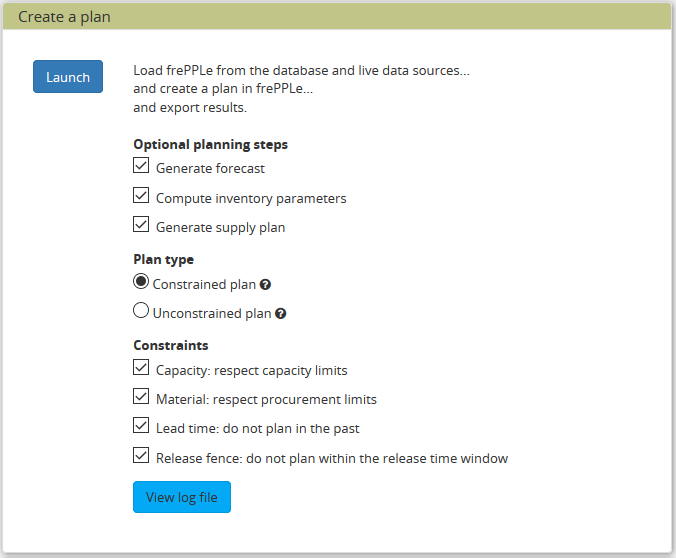

===============
Generate a plan
===============

The plan generation screen can be found under the Admin/Execute menu.

This option runs the frePPLe planning engine with the input data from the
database. The planning results are exported back into the database.

Optionally, on the Enterprise edition, the forecast and 
inventory planning modules can be run independently prior to the plan generation.

The supply plan generation box has to be ticked to generate purchase orders.

The forecast solver will calculate the forecast based on the historical demand for all
(item, location, customer) intersections declared in the Forecast table.

The inventory planning solver will compute a safety stock and a reorder quantity for
all buffers declared in the inventory planning parameters table.

Two main plan types can be distinguished, based on whether you want to
see demand OR material, lead time and capacity problems to be shown.

* A **constrained plan** respects all enabled constraints. In case of shortages
  the demand is planned late or short. No any material or capacity shortages
  are present in the plan.

* An **unconstrained plan** shows material, capacity and operation problems
  that prevent the demand from being planned in time. The demand is always met
  completely and on time.

In both the constrained and unconstrained plans you can select which constraints
are considered during plan creation.

**Reading the plan**

The forecast calculated by the forecast solver is displayed in the forecast report
and in the forecast editor.

The reorder quantity and safety stock values calculated by the inventory planning solver can be 
found in the Inventory Planning screen under Inventory/Inventory Planning menu.

The generated distribution orders (when applicable) can be found under the Inventory/Distribution Orders menu.

The generated manufacturing orders (when applicable) can be found under the Manufacturing/Manufacturing Orders menu.

The generated purchase orders (when applicable) can be found under the Purchasing/Purchase Orders menu.

Note that all the generated orders (purchase, distribution and manufacturing) will have status equal to "proposed" 
as they still have to be approved by the planner to be sent to your ERP system.

