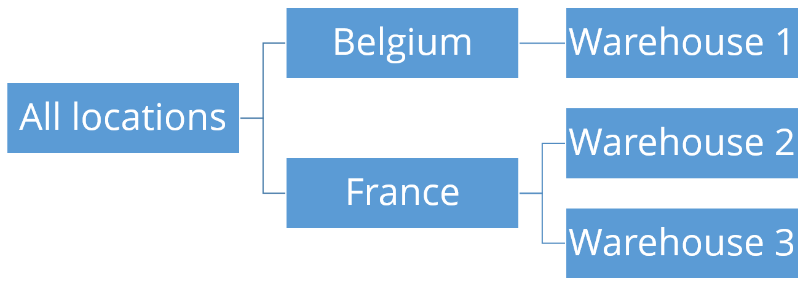

=========
Locations
=========

The Locations table contains the different locations included in your model. A location
can be a warehouse, a distribution center, a factory, a shop...

Note that you don't need to put in the location table your supplier or customer locations.

.. rubric:: Key Fields

============ ================= ===========================================================
Field        Type              Description
============ ================= ===========================================================
name         non-empty string  Unique name of the location.
owner        location name     Hierachical parent of the location.
============ ================= ===========================================================

.. rubric:: Location hierarchy

.. Hint::

   Setting up a good location hierarchy is important if you are interested in the demand forecasting functionality. 
   Otherwise, you can skip modeling a location hierarchy.

Using the owner field the locations can be organized in a hierarhical tree structure. This allows,
among other, reviewing the forecast at different levels in the 
:doc:`../../user-interface/plan-analysis/forecast-editor`.

Here is an example to model a tree structure with warehouses in multiple countries:

============= =============
Name          Owner
============= =============
All locations  
Belgium       All locations
Warehouse 1   Belgium
France        All locations
Warehouse 2   France
Warehouse 3   France
============= =============

.. rubric:: Advanced topics

* Complete table description: :doc:`../../model-reference/locations`

* Modeling working hours: :doc:`../../cookbook/calendar/working-hours` 
