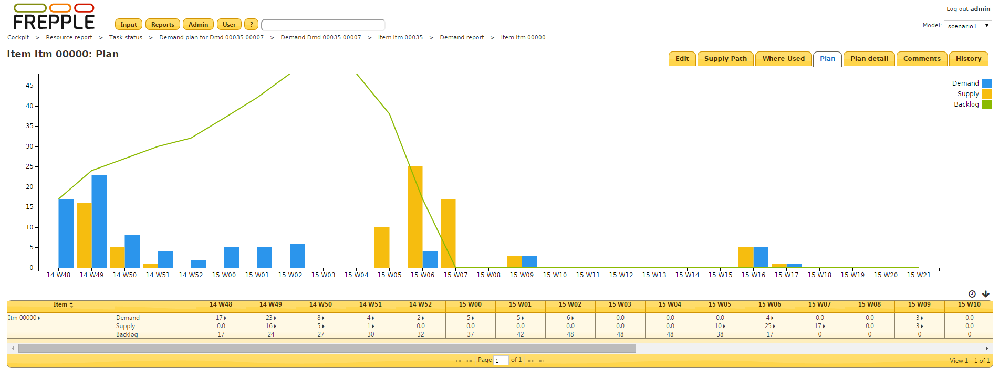
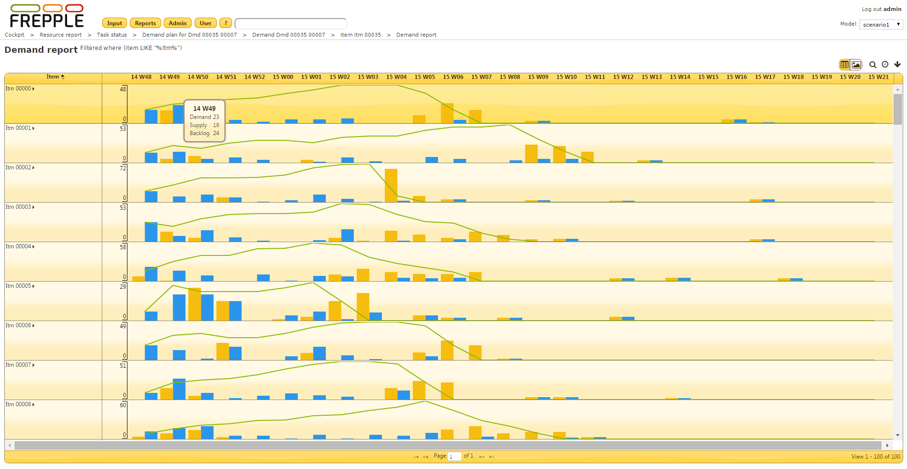
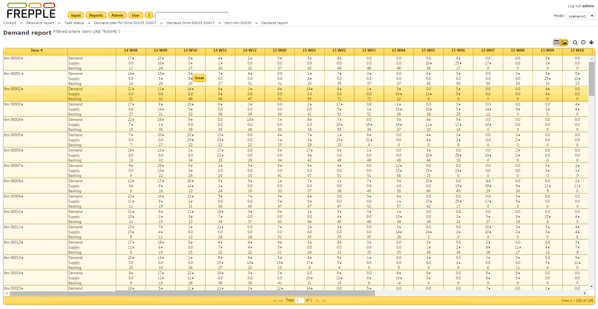

=============
Demand report
=============

This report shows per item and per time bucket the demand quantity, the supplied quantity and the backlog.

A drilldown report is also available to show the detailed data as a list.

If the report is opened for a single item a graph is displayed.

| Given the row definitions, the following equations apply:
|   **total demand = net forecast + orders**
|   **backlog = backlog of previous bucket + total demand – total supply**

============ ==============================================================================
Field        Description
============ ==============================================================================
Item         Item name.
Net forecast Amount of net forecast in the time bucket (only in Enterprise edition).
Orders       Amount of customer orders (only in Enterprise edition).
Total demand Total demand for this item due in the time bucket.
Total supply Satisfied deliveries for this item in the time bucket.
Backlog      Difference between the supply and demand, accumulated across time buckets.
============ ==============================================================================

