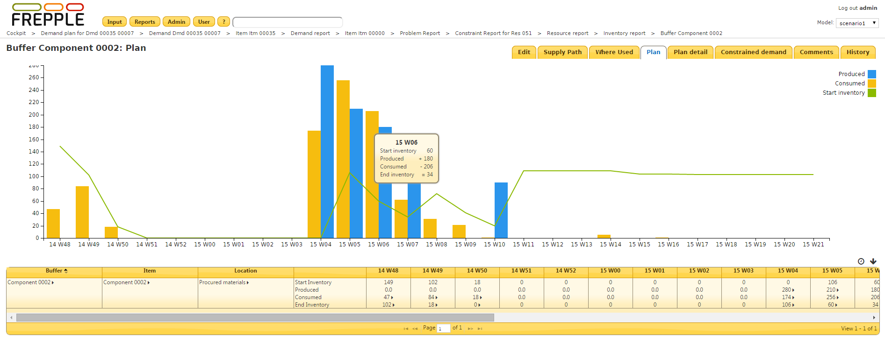
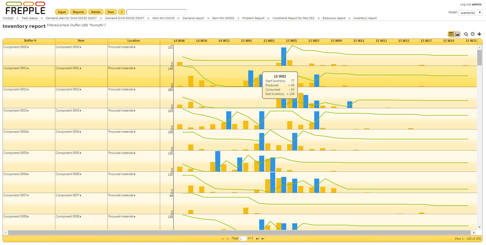

================
Inventory report
================

The report shows per buffer and per time bucket the inventory profile:
the starting inventory, the material consumed, the material produced and
the ending inventory.

If the report is opened for a single buffer an inventory graph is displayed.

| The rows in the report are defined such that following equations apply:
|   **end inventory = start inventory + produced – consumed**
|   **start inventory = end inventory of the previous time bucket**

================= ==============================================================================
Field             Description
================= ==============================================================================
Item              Item stored in the buffer.
Location          Location of the buffer.
Start inventory   Inventory in the buffer at the start of the time bucket.
Produced          | Quantity produced into the buffer during the time bucket.
                  | A drill down menu is available to see the detail of the producing operations,
                    and to see the demands the consumed material is used for.
Consumed          | Quantity consumed into the buffer during the time bucket.
                  | A drill down menu is available to see the detail of the consuming operations,
                    and to see the demands the consumed material is used for.
End inventory     | Inventory in the buffer at the end of the time bucket.
                  | A drill down menu is available to see the detail of the consuming and
                    producing operations, and to see the demands the consumed material is used
                    for.
================= ==============================================================================

.. image:: ../_images/inventory-report-table.png
   :alt: Inventory report as a table
