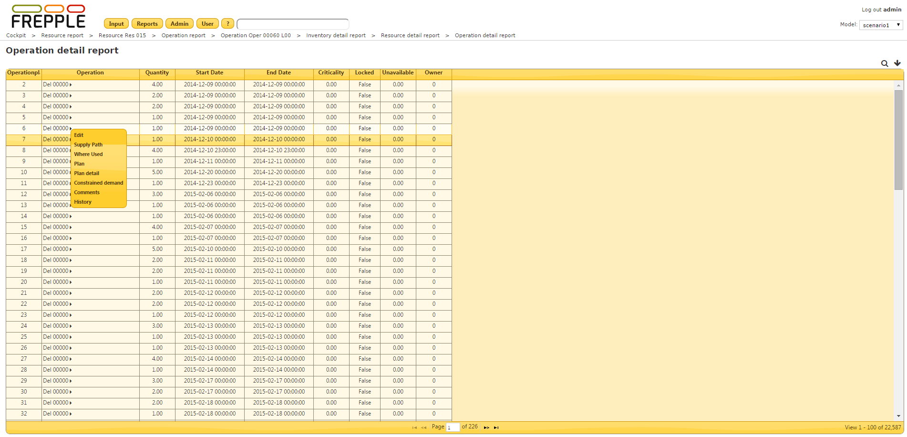

=======================
Operation detail report
=======================

The report shows the details of all operations planned. It displays their start
date, end date and quantity.

================= ==============================================================================
Field             Description
================= ==============================================================================
Operationplan     Identifier of this operation instance.
Operation         Name of the operation.
Quantity          Quantity of the operationplan.
Start date        Start date of the operationplan.
End date          | End date of the operationplan.
                  | Note that in case of unavailable time, the difference between the start and
                    end date can be bigger than the specified duration of the operation. For
                    instance, if the weekends are modelled as unavailable time, an operation
                    with a duration of 1 day can start on friday 7AM and end on monday 7AM.
Criticality       | Indication of the urgency of the operationplan.
                  | A criticality of 0 indicates that the operationplan is on the critical
                    path of one or more demands.
                  | Higher criticality values indicate a delay of the operationplan will
                    not immediately impact the delivery of any demand.
                  | A criticality of 999 indicates an operationplan that isn't used at all to
                    meet any demand.
Locked            Locked operationplans are frozen and can’t be touched during planning.
                  Such operationplans model for instance confirmed supplier deliveries,
                  work in progress operations, etc.
Unavailable       | Total unavailable time over the duration of the operationplan.
                  | Continuing on the above example, the unavailable time would be 2 days.
Owner             In case of nested operationplans this field shows the identifier of the
                  owning operationplan. This applies to alternate operations and to routing
                  operations.
================= ==============================================================================

