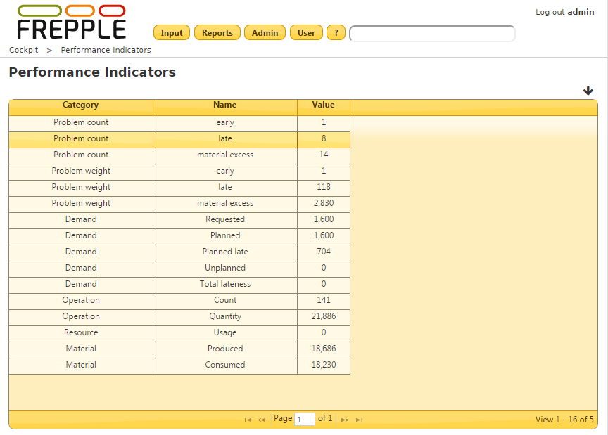

============================
Performance indicator report
============================

This report shows some key metrics of the generated plan. In this way it
allows quick review of the plan quality, comparisons between different plans,
and validation of model or parameter changes.

The metrics being reported are:

* | **Problems**
  | For each problem category the total number of problems is reported, as
    well as the sum of their weights.

* | **Demand**
  | The total requested quantity of demand (including both net forecast
    and customer orders) is reported.
  | The total planned quantity is shown, which in absence of any constraints
    matches the requested quantity. Any difference between the requested
    and planned quantity is reported as the unplanned quantity.
  | The demand satisfied late is reported both as quantity and in total
    lateness (being the quantity planned late multiplied by the delay in days).

* | **Operation**
  | The total number of operationplans as well the summed up quantity is shown.

* | **Resource**
  | The total resource consumption is displayed. The consumption is defined
    as the load size * load duration in days.

* | **Material**
  | The total produced and consumed quantities (including raw material,
    finished goods as well as intermediate buffers) is displayed. When the
    produced quantity exceeds the consumed quantity the inventory is increasing
    over the planning horizon.

.. caution::
  It is important to note that these KPIs provide only a high level and very
  rough indication on the plan. They are in no way intended to be used for
  reporting the plan results to management. For instance, the metrics assign
  the same importance to a delay of a high priority customer and a low priority
  forecast, the numbers give equal weight to inventory of a 1$ component and a
  1000$ end item, etc.

