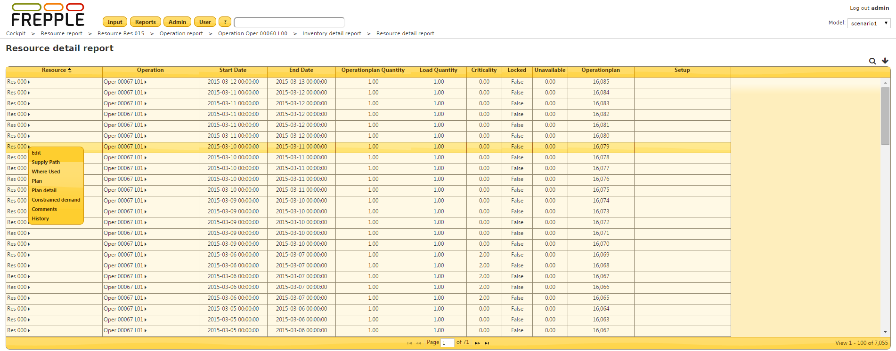

======================
Resource detail report
======================

The report shows the details of all loading on the resources.

================= ==============================================================================
Field             Description
================= ==============================================================================
Resource          Resource name.
Operation         | Name of the operation loading the resource.
                  | If the name is “setup operation” this load plan shows a conversion of the
                    resource to a new setup.
Start date        Date when the load plan starts.
End date          Date when the load plan ends.
| Operatioplan    Quantity of the operationplan.
  quantity
| Load            Size of the loadplan.
  quantity
Criticality       | Indication of the urgency of the operationplan.
                  | A criticality of 0 indicates that the operationplan is on the critical
                    path of one or more demands.
                  | Higher criticality values indicate a delay of the operationplan will
                    not immediately impact the delivery of any demand.
                  | A criticality of 999 indicates an operationplan that isn't used at all to
                    meet any demand.
Locked            Locked operationplans are frozen and can’t be touched during planning.
                  Such operationplans model for instance confirmed supplier deliveries,
                  work in progress operations, etc.
Setup             Setup of the resource during this loading.
Operationplan     Identifier of the operation plan loading the resource.
================= ==============================================================================

