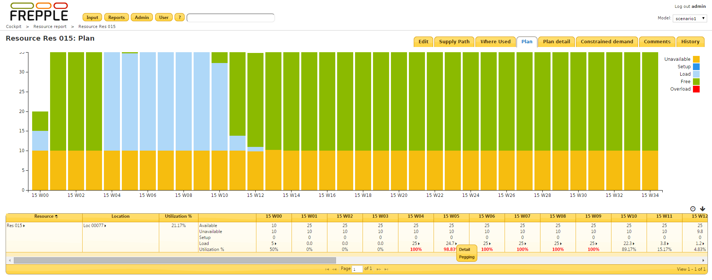
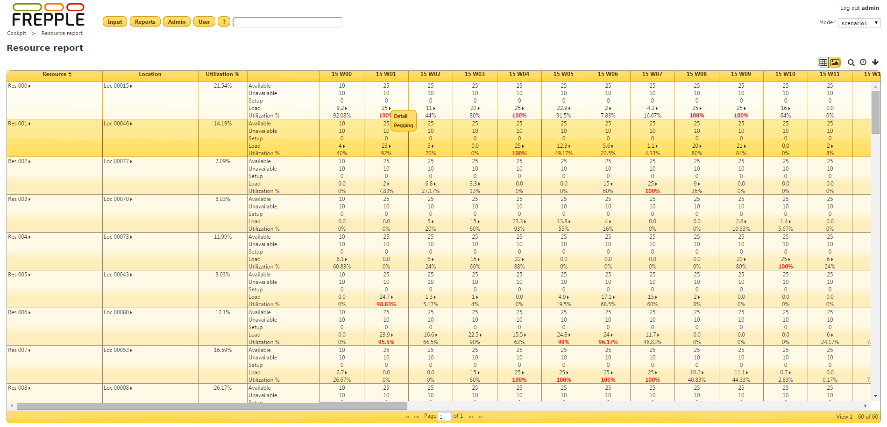

===============
Resource report
===============

This report shows the loading of the resources.

If the report is opened for a single resource a load graph is displayed.

The report shows the plan result in size*time.
E.g. a resource has size 1 and we are looking at a weekly bucket: available = 7
E.g. a resource has size 3 and we are looking at a weekly bucket: available = 21
The parameter **loading_time_units** defines the time units. Acceptable values are hours, days and weeks.

================= ==============================================================================
Field             Description
================= ==============================================================================
Resource          Resource name.
Location          Location of the resource.
Available         Total availability on the resource.
Unavailable       Unavailable time, as defined in the availability calendar of the resource’s
                  location.
Setup             Time spent in conversions between setups.
Load              Time spent on actual operationplans.
Utilization       | Equal to the load divided by the available time, expressed as percentage.
                  | The utilization % just right before the graph is the average utilization
                    over the complete reporting horizon. The value for each bucket in that
                    horizon is show in the cells on the right.
================= ==============================================================================

.. image:: ../_images/resource-report-graph.png
   :alt: Resource report as a graph

