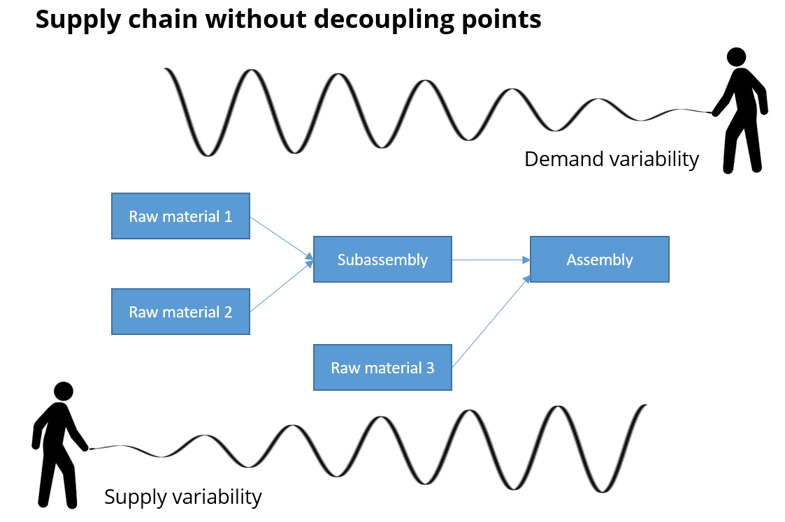
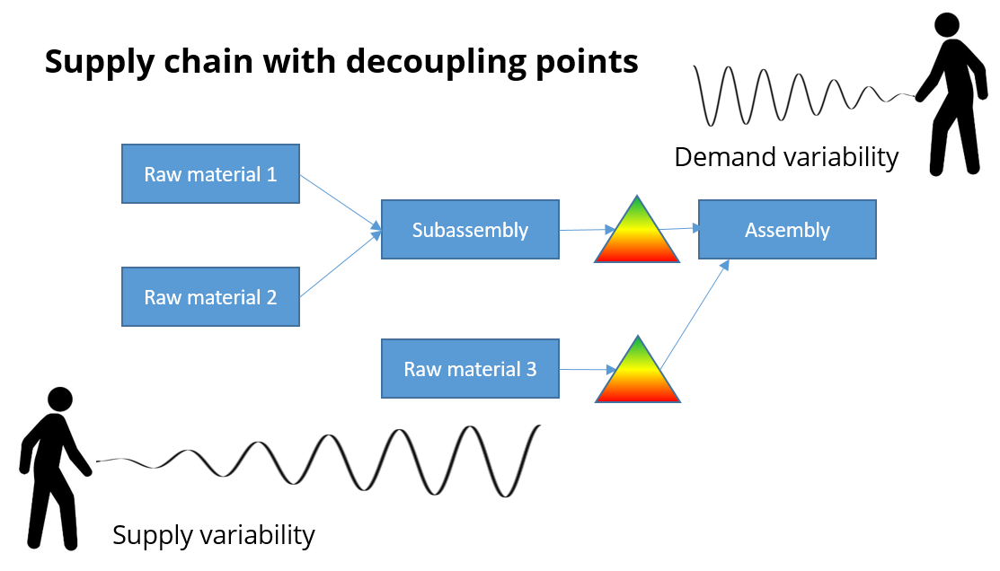
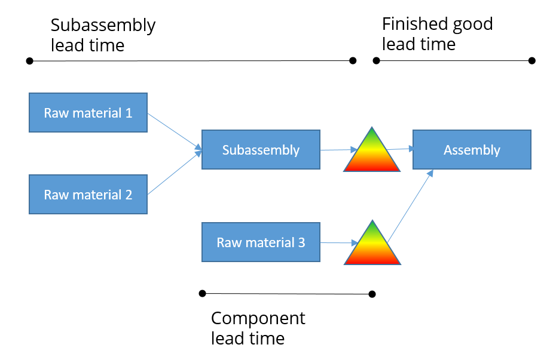
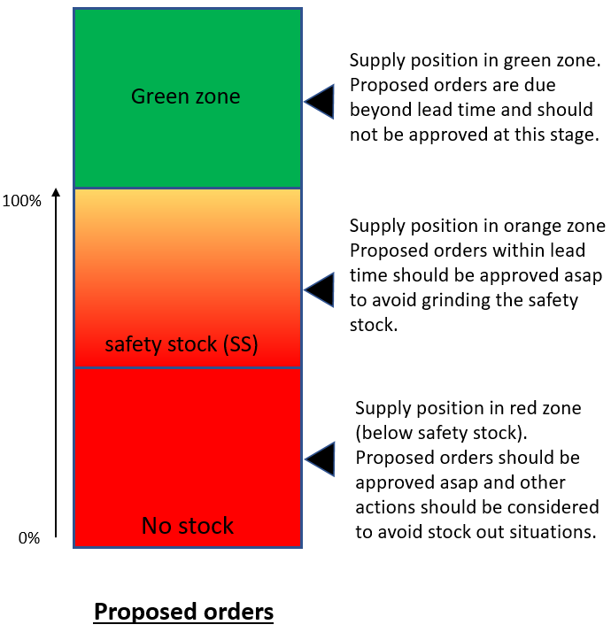

===========================
Strategic decoupling points
===========================

Any supply chain or manufacturing process will need decoupling points
where inventory is kept.

This inventory serves 2 purposes:

   

- **The inventory dampens variability**, coming both from the supply and the 
  demand sides. Inventory at the decoupling points creates a safety buffer
  to cover situation when things don't happen completely as planned.

  | Without the inventory at the decoupling points, a disturbance on the 
    supplier side can have an amplified impact on the customer demand.
  | Similarly, a change on the customer demand can cause an amplified
    change in the raw material requirements for suppliers.
  | This is known as the |bullwhip_link|.
  
  .. |bullwhip_link| raw:: html
  
     <a href="https://en.wikipedia.org/wiki/Bullwhip_effect" target="_blank">bullwhip effect</a>
  
  .. raw:: html

     

     

- | **The inventory divides the total lead time**. 
  | Finished products can be served to customers without waiting the purchasing lead time
    of some components or raw materials.
  
  Each section of the supply chain is protected by the inventories and can be planned
  with its own decoupled lead time.
  
  .. raw:: html

     

| At the decoupling points your planners need to make an important decision on
  how much inventory to carry. A higher inventory level increases the dampening 
  and decoupling effects, but obviously brings additional costs.
| The desired inventory level at each decoupling point is an important parameter
  for your planning process.

For each decoupling point we need to establish two important metrics:
 - | **Safety stock level**:
   | The safety stock level cover for any demand or lead time variability.
 - | **Reorder quantity**:
   | When triggering a replenishment, the reorder quantity is the (minimum) 
     quantity proposed by frePPLe in the replenishment order.

A decoupling point defines different inventory zones:

- The **red zone** represents the safety stock level.

- The **orange zone** represents the average replenishment pipeline, i.e. the average
  number of replenishment orders that is open at any moment.

- The **green zone** represents the reorder quantity.

A new replenishment needs to be launched when the supply position reaches the
level of the red plus orange zone.  The supply position is defined as

   supply position = on hand + confirmed orders - overdue orders
   

